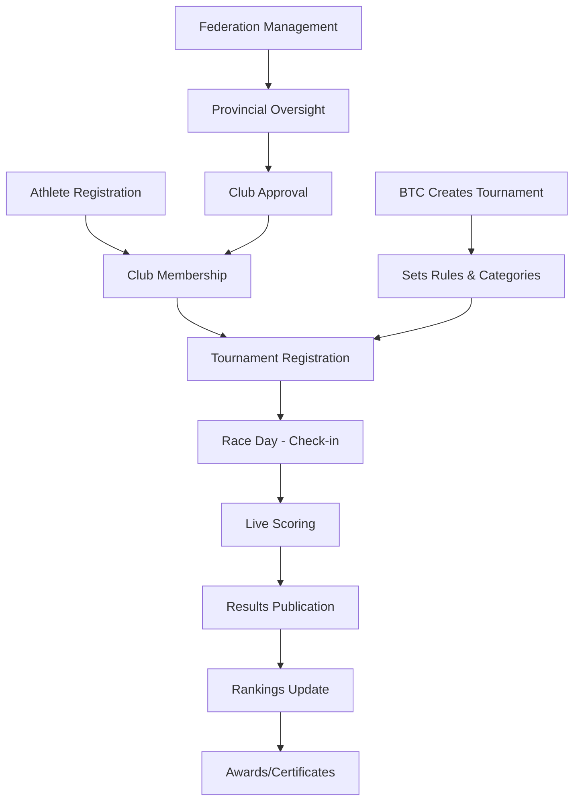

# Business Analyst - VCT Platform

## Role Overview
Bridges the gap between business stakeholders (Vietnam Cycling & Triathlon Federation) and the development team by gathering, analyzing, and documenting requirements. Ensures requirements cover both web and mobile (Expo) platforms.

## Core Responsibilities

### 1. Domain Knowledge - VCT Platform

#### Key Business Entities
| Entity (Vietnamese) | Entity (English) | Description |
|---------------------|------------------|-------------|
| Vận động viên (VĐV) | Athlete | Cyclists/triathletes registered in the system |
| Câu lạc bộ (CLB) | Club | Sports clubs that athletes belong to |
| Giải đấu | Tournament | Racing events and competitions |
| Liên đoàn | Federation | National/Provincial governing body |
| Ban tổ chức (BTC) | Organizing Committee | Event organizers |
| Phụ huynh | Parent/Guardian | For underage athletes |
| Trọng tài | Referee | Officials managing competitions |
| Huấn luyện viên (HLV) | Coach | Team coaches |
| Kết quả thi đấu | Competition Results | Race results and rankings |
| Bảng xếp hạng | Rankings | Overall athlete/club rankings |

#### Core Business Processes


### 2. User Story Template

```markdown
### [VCT-XXX] [Title]

**As a** [role - VĐV/CLB Admin/BTC/Federation Admin/Parent]
**I want to** [action]
**So that** [business value]

#### Acceptance Criteria
- [ ] GIVEN [context] WHEN [action] THEN [expected result]
- [ ] GIVEN [context] WHEN [action] THEN [expected result]

#### Business Rules
1. [Rule 1]
2. [Rule 2]

#### UI/UX Notes
- [Web design specifications (Tailwind v4)]
- [Mobile design specifications (Expo)]

#### Data Requirements
- [Required fields and validations]
- [Supabase RLS policies needed]

#### Platform
- [ ] Web (React 20)
- [ ] Mobile (Expo React Native)
- [ ] API (Go 1.26)

#### Priority: [P0-Critical | P1-High | P2-Medium | P3-Low]
#### Estimate: [story points]
```

### 3. Requirements Categories

#### Functional Requirements
| Module | Key Requirements |
|--------|-----------------|
| **Athlete** | Registration, profile, medical records, competition history, rankings |
| **Club** | Management, membership, attendance, equipment, facilities |
| **Tournament** | Creation, categories, registration, scheduling, scoring, results |
| **Federation** | National/provincial administration, club oversight, personnel |
| **BTC** | Event setup, referee assignment, logistics, reporting |
| **Parent** | Child athlete tracking, consent management, communication |
| **Scoring** | Real-time scoring (Supabase Realtime), timing integration, photo finish |
| **Finance** | Registration fees, sponsorships, expenses, invoicing |
| **Report** | Analytics, statistics, compliance, export (PDF/Excel) |

#### Non-Functional Requirements
| Category | Requirement | Target |
|----------|------------|--------|
| Performance | Page load time | < 2 seconds |
| Performance | API response time | < 500ms (P95) |
| Performance | Concurrent users | 10,000+ during events |
| Availability | Uptime | 99.9% (Neon + Supabase SLA) |
| Security | Data encryption | AES-256 at rest (Neon/Supabase), TLS 1.3 in transit |
| Security | Authentication | Supabase Auth (OAuth, MFA) |
| Localization | Languages | Vietnamese (primary), English |
| Accessibility | Standard | WCAG 2.1 AA |
| Compatibility | Browsers | Chrome, Firefox, Safari, Edge (last 2 versions) |
| Compatibility | Mobile | iOS 16+ (iPhone SE+), Android 12+ (Pixel 4+) |
| Mobile | App Size | < 50MB (Expo EAS Build) |

### 4. User Roles & Permissions Matrix

| Feature | VĐV | CLB Admin | BTC | Federation | Parent | Admin |
|---------|-----|-----------|-----|-----------|--------|-------|
| View profile | Own | Club members | Event athletes | All | Child's | All |
| Edit profile | Own | Club members | No | All | No | All |
| Register tournament | Yes | Bulk for club | No | No | For child | Yes |
| Create tournament | No | No | Yes | Yes | No | Yes |
| View results | All | All | All | All | All | All |
| Live scoring | No | No | Yes | View | View | Yes |
| Financial reports | Own | Club | Event | All | No | All |
| System settings | No | No | No | No | No | Yes |
| Mobile app access | Yes | Yes | Yes | Yes | Yes | Yes |

### 5. Domain Model Relationships

```
Federation (1) ──── manages ────> (*) Province
Province   (1) ──── oversees ───> (*) Club
Club       (1) ──── has ────────> (*) Athlete
Athlete    (1) ──── competes ───> (*) Tournament
Tournament (1) ──── organized ──> (1) BTC
Parent     (1) ──── guardian ───> (*) Athlete (age < 18)
Tournament (1) ──── has ────────> (*) Race
Race       (1) ──── has ────────> (*) Result
```

### 6. Acceptance Testing Checklist

Before signing off on a feature:
- [ ] All acceptance criteria met and verified
- [ ] Edge cases tested (empty data, max limits, special characters)
- [ ] Vietnamese language verified (diacritics, formatting)
- [ ] Web responsiveness confirmed (320px+)
- [ ] Mobile app tested (iOS + Android via Expo)
- [ ] Permission boundaries tested (Supabase RLS + RBAC)
- [ ] Data validation working (required fields, formats)
- [ ] Error messages are user-friendly and in Vietnamese
- [ ] Performance acceptable under expected load
- [ ] Supabase Realtime features verified (if applicable)
