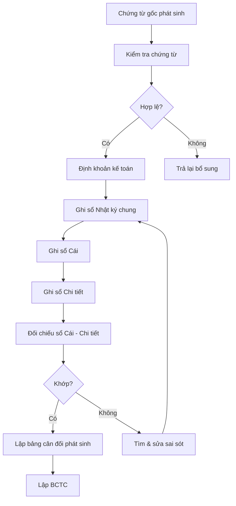
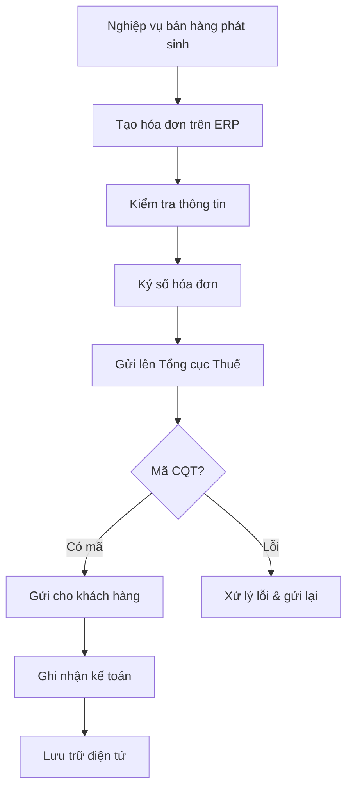
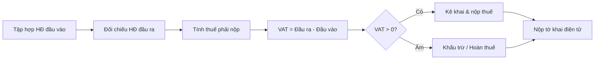
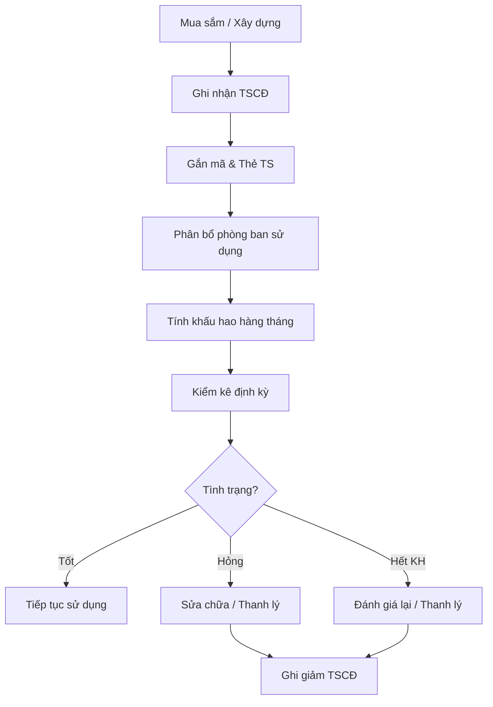
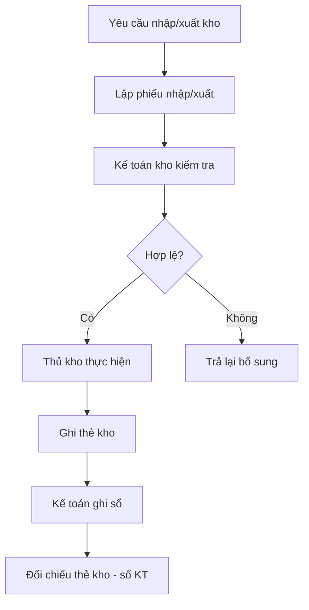
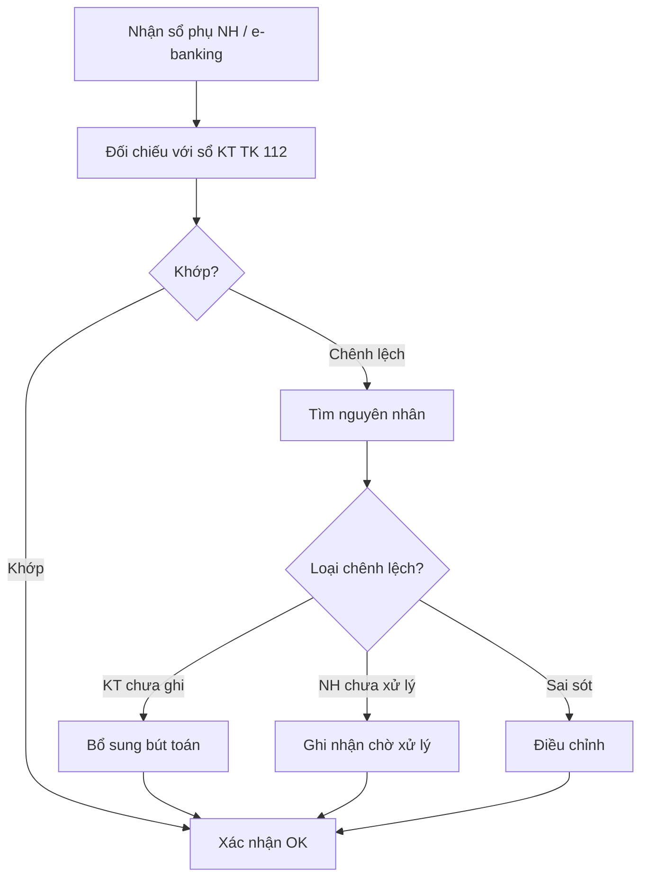

# Kế toán - ERP Module

## Tổng quan
Phòng Kế toán chịu trách nhiệm ghi nhận, phân loại, tổng hợp các nghiệp vụ kinh tế phát sinh, lập báo cáo tài chính theo chuẩn mực kế toán Việt Nam (VAS), quản lý thuế và tuân thủ pháp luật.

## Vai trò & Nhân sự

| Vai trò | Trách nhiệm |
|---------|-------------|
| Kế toán trưởng | Phụ trách chung, ký BCTC, chịu trách nhiệm trước PL |
| KT Tổng hợp | Tổng hợp sổ sách, lập BCTC, đối chiếu |
| KT Bán hàng | Hóa đơn bán, doanh thu, công nợ phải thu |
| KT Mua hàng | Hóa đơn mua, chi phí, công nợ phải trả |
| KT Kho | Nhập/xuất kho, tính giá vốn, tồn kho |
| KT Ngân hàng | Theo dõi tài khoản NH, đối chiếu sổ phụ |
| KT Thuế | Kê khai VAT, TNCN, TNDN, báo cáo thuế |
| KT Tài sản | Quản lý TSCĐ, tính khấu hao |
| KT Tiền lương | Tính lương, BHXH, TNCN |
| Thủ quỹ | Quản lý tiền mặt, thu chi quỹ |

## Quy trình nghiệp vụ

### 1. Hệ thống Tài khoản Kế toán (Chart of Accounts)

#### Theo Thông tư 200/2014/TT-BTC
```
Loại 1: Tài sản ngắn hạn
├── 111 - Tiền mặt
├── 112 - Tiền gửi ngân hàng
├── 131 - Phải thu khách hàng
├── 133 - Thuế GTGT được khấu trừ
├── 141 - Tạm ứng
├── 152 - Nguyên vật liệu
├── 153 - Công cụ, dụng cụ
├── 155 - Thành phẩm
├── 156 - Hàng hóa
└── 157 - Hàng gửi bán

Loại 2: Tài sản dài hạn
├── 211 - Tài sản cố định hữu hình
├── 213 - TSCĐ vô hình
├── 214 - Hao mòn TSCĐ
├── 217 - Bất động sản đầu tư
├── 221 - Đầu tư vào công ty con
├── 228 - Đầu tư khác
└── 242 - Chi phí trả trước

Loại 3: Nợ phải trả
├── 331 - Phải trả người bán
├── 333 - Thuế và các khoản phải nộp NN
├── 334 - Phải trả người lao động
├── 335 - Chi phí phải trả
├── 338 - Phải trả, phải nộp khác
├── 341 - Vay và nợ thuê tài chính
└── 352 - Dự phòng phải trả

Loại 4: Vốn chủ sở hữu
├── 411 - Vốn đầu tư của CSH
├── 413 - Chênh lệch tỷ giá
├── 414 - Quỹ đầu tư phát triển
├── 418 - Các quỹ khác
├── 419 - Cổ phiếu quỹ
└── 421 - Lợi nhuận sau thuế chưa PP

Loại 5: Doanh thu
├── 511 - Doanh thu bán hàng và CCDV
├── 515 - Doanh thu hoạt động tài chính
└── 521 - Các khoản giảm trừ doanh thu

Loại 6: Chi phí sản xuất KD
├── 621 - Chi phí NVL trực tiếp
├── 622 - Chi phí nhân công trực tiếp
├── 623 - Chi phí sử dụng MTC
├── 627 - Chi phí SX chung
├── 631 - Giá thành sản xuất
├── 632 - Giá vốn hàng bán
├── 635 - Chi phí tài chính
├── 641 - Chi phí bán hàng
└── 642 - Chi phí quản lý DN

Loại 7: Thu nhập khác
├── 711 - Thu nhập khác
└── 811 - Chi phí khác

Loại 8: Xác định KQKD
├── 821 - Chi phí thuế TNDN
└── 911 - Xác định KQKD
```

### 2. Quy trình Ghi sổ Kế toán



#### Một số Bút toán Phổ biến
| Nghiệp vụ | Nợ | Có |
|-----------|-----|-----|
| Bán hàng thu tiền mặt | 111 | 511 |
| Bán hàng công nợ | 131 | 511 |
| VAT đầu ra | 131/111 | 33311 |
| Mua hàng nhập kho | 156 | 331/111 |
| VAT đầu vào | 1331 | 331/111 |
| Chi lương | 334 | 111/112 |
| Trích BHXH | 642/622 | 3383/3384/3389 |
| Khấu hao TSCĐ | 642/641/627 | 214 |
| Kết chuyển doanh thu | 511 | 911 |
| Kết chuyển chi phí | 911 | 632/641/642 |

### 3. Quản lý Hóa đơn Điện tử (e-Invoice)



#### Quy định Hóa đơn Điện tử (Nghị định 123/2020, TT78/2021)
| Loại HĐ | Mã | Sử dụng |
|---------|-----|---------|
| HĐ GTGT | 1 | DN nộp thuế theo PP khấu trừ |
| HĐ bán hàng | 2 | DN nộp thuế theo PP trực tiếp |
| HĐ khởi tạo từ máy tính tiền | 6 | Bán lẻ |
| Phiếu xuất kho kiêm VCNB | 7 | Vận chuyển nội bộ |

### 4. Kê khai Thuế

#### Lịch Kê khai Thuế
| Loại thuế | Kỳ kê khai | Hạn nộp | Mẫu biểu |
|----------|-----------|---------|---------|
| Thuế GTGT (VAT) | Tháng / Quý | Ngày 20 tháng sau | 01/GTGT |
| Thuế TNCN | Tháng / Quý | Ngày 20 tháng sau | 05/KK-TNCN |
| Thuế TNDN tạm tính | Quý | Ngày 30 quý sau | 01/TNDN |
| Thuế TNDN quyết toán | Năm | Ngày cuối tháng 3 năm sau | 03/TNDN |
| Quyết toán TNCN | Năm | Ngày cuối tháng 3 năm sau | 05/QTT-TNCN |

#### Quy trình Kê khai VAT


### 5. Quản lý Tài sản Cố định & Khấu hao

#### Phân loại TSCĐ
| Nhóm | Thời gian KH | Phương pháp |
|------|-------------|------------|
| Nhà cửa, vật kiến trúc | 10-50 năm | Đường thẳng |
| Máy móc, thiết bị | 5-15 năm | Đường thẳng / Giảm dần |
| Phương tiện vận tải | 6-10 năm | Đường thẳng |
| Thiết bị văn phòng | 3-8 năm | Đường thẳng |
| Phần mềm máy tính | 3-5 năm | Đường thẳng |
| Bản quyền, nhãn hiệu | 5-20 năm | Đường thẳng |

#### Quy trình Quản lý TSCĐ


### 6. Quản lý Kho & Tính Giá vốn

#### Phương pháp Tính giá vốn
| Phương pháp | Mô tả | Phù hợp |
|------------|--------|---------|
| Bình quân gia quyền | Giá TB = Tổng giá trị / Tổng SL | Hàng hóa phổ thông |
| FIFO (Nhập trước - Xuất trước) | Xuất theo giá lô nhập trước | Hàng có hạn sử dụng |
| Đích danh | Theo dõi giá từng lô | Hàng giá trị cao, đặc thù |

#### Quy trình Nhập xuất kho


### 7. Đối chiếu Ngân hàng



### 8. Khóa sổ & Lập BCTC

#### Quy trình Khóa sổ Cuối kỳ
| Bước | Nội dung | Thời điểm |
|------|---------|----------|
| 1 | Kiểm tra chứng từ phát sinh | Ngày 1-3 tháng sau |
| 2 | Tính khấu hao, phân bổ | Ngày 3 |
| 3 | Kết chuyển doanh thu, chi phí | Ngày 5 |
| 4 | Đối chiếu công nợ | Ngày 5-7 |
| 5 | Đối chiếu ngân hàng | Ngày 7 |
| 6 | Cân đối phát sinh | Ngày 8 |
| 7 | Lập BCTC | Ngày 10 |
| 8 | KTT review & ký | Ngày 12 |
| 9 | Gửi BGĐ | Ngày 15 |

## Quyền hạn trong ERP

| Chức năng | KTT | KT Tổng hợp | KT Chi tiết | Thủ quỹ |
|-----------|-----|-----------|-----------|---------|
| Ghi sổ | Duyệt | Full | Phần hành | Không |
| Phê duyệt chứng từ | Full | Kiểm tra | Lập | Xác nhận thu/chi |
| Hóa đơn điện tử | Ký số | Lập & gửi | Lập | Không |
| Kê khai thuế | Ký | Lập | Hỗ trợ | Không |
| BCTC | Ký & duyệt | Lập | Không | Không |
| Đối chiếu NH | Duyệt | Thực hiện | Không | Xác nhận |
| Quỹ tiền mặt | Kiểm tra | Theo dõi sổ | Không | Quản lý |
