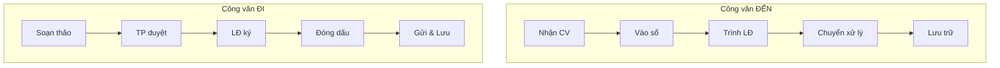
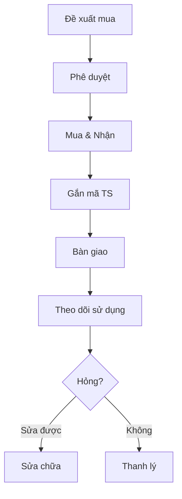
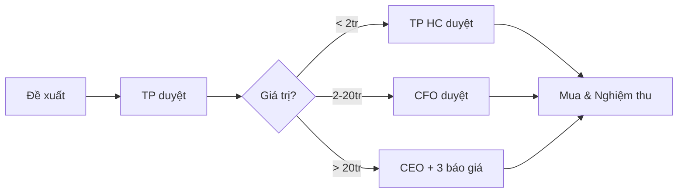

# Hành chính & Văn phòng - ERP Module

## Tổng quan
Phòng Hành chính đảm bảo hoạt động vận hành hàng ngày: quản lý văn bản, tài sản, cơ sở vật chất, phòng họp, mua sắm VPP, và dịch vụ hậu cần.

## Vai trò & Nhân sự

| Vai trò | Trách nhiệm |
|---------|-------------|
| Trưởng phòng HC | Quản lý chung, chính sách HC |
| Chuyên viên Văn thư | Văn bản, công văn đi/đến |
| Chuyên viên HC | Tài sản, thiết bị, phòng họp |
| Lễ tân | Đón tiếp, điện thoại, bưu phẩm |
| Bảo vệ | An ninh, kiểm soát ra vào |
| Kỹ thuật | Sửa chữa, bảo trì CSVC |

## Quy trình nghiệp vụ

### 1. Quản lý Văn bản & Công văn

| Loại | Thời hạn xử lý | Lưu trữ |
|------|----------------|---------|
| Khẩn | 24h | Vĩnh viễn |
| Thường | 3-5 ngày | 5-10 năm |
| Nội bộ | 3 ngày | 2-5 năm |
| Quyết định | Theo nội dung | Vĩnh viễn |
| Hợp đồng | Theo nội dung | Suốt HĐ + 5 năm |

### 2. Quản lý Tài sản & Thiết bị

| Nhóm | Kiểm kê |
|------|---------|
| Thiết bị CNTT (laptop, PC, máy in) | 6 tháng |
| Nội thất (bàn, ghế, tủ) | Năm |
| Điện lạnh | 6 tháng |
| Phương tiện | Tháng |
| An ninh (camera, cửa từ) | Quý |

### 3. Phòng họp & Lịch họp

| Phòng | Sức chứa | Trang bị | Ưu tiên |
|-------|---------|---------|---------|
| VIP / Boardroom | 20-30 | Projector, video conf | BGĐ |
| Phòng họp lớn | 10-20 | TV, whiteboard | Phòng ban |
| Phòng họp nhỏ | 4-8 | TV, whiteboard | Nhóm |
| Phone booth | 1-2 | Cách âm | Cá nhân |

### 4. Quy trình Mua sắm

### 5. Quản lý VPP & Kho vật tư

| Nhóm | Định mức/người/tháng |
|------|---------------------|
| Giấy in A4 | 100 tờ |
| Bút bi/gel | 2 cây |
| Sổ tay | 1 cuốn |
| Mực in | Theo máy |

### 6. Lưu trữ Hồ sơ

| Loại tài liệu | Thời gian lưu |
|---------------|-------------|
| Hồ sơ nhân sự | NV ở + 5 năm |
| Chứng từ KT | 10 năm |
| Hợp đồng KT | HĐ + 5 năm |
| Văn bản pháp lý | Vĩnh viễn |
| Báo cáo quản trị | 5 năm |

### 7. Hợp đồng Dịch vụ

| Loại HĐ | Đánh giá |
|---------|---------|
| Thuê VP | Năm |
| Vệ sinh | Quý |
| Bảo vệ | Quý |
| Internet | Năm |
| Bảo trì HVAC | 6 tháng |

## Quyền hạn trong ERP

| Chức năng | TP HC | Văn thư | CV HC | NV |
|-----------|-------|---------|-------|-----|
| Văn bản | Full | Quản lý | Xem | Xem liên quan |
| Tài sản | Phê duyệt | Không | Quản lý | Xem cá nhân |
| Phòng họp | Full | Không | Quản lý | Đặt phòng |
| Mua sắm | Phê duyệt | Không | Đề xuất | Đề xuất |
| VPP | Phê duyệt | Không | Cấp phát | Yêu cầu |
