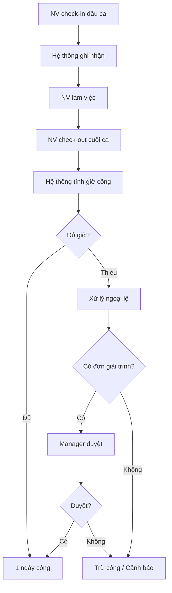
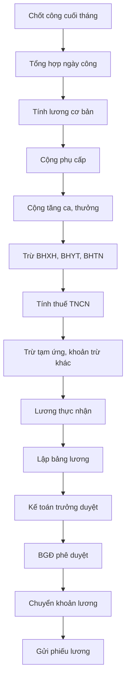
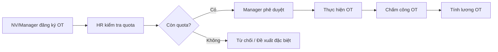

# Chấm công & Tính lương - ERP Module

## Tổng quan
Module Chấm công & Tính lương quản lý toàn bộ quy trình theo dõi thời gian làm việc, tính toán lương, phụ cấp, bảo hiểm xã hội, thuế thu nhập cá nhân, và xuất bảng lương hàng tháng.

## Vai trò & Nhân sự

| Vai trò | Trách nhiệm |
|---------|-------------|
| C&B Manager | Quản lý chính sách lương, phúc lợi |
| Payroll Specialist | Tính lương, đối chiếu, xuất bảng lương |
| Timekeeper | Quản lý chấm công, xử lý ngoại lệ |
| BHXH Specialist | Kê khai BHXH, BHYT, BHTN |
| HR Admin | Hỗ trợ thủ tục hành chính |

## Quy trình nghiệp vụ

### 1. Hệ thống Chấm công

#### Phương thức Chấm công
| Phương thức | Mô tả | Ưu điểm | Nhược điểm |
|------------|--------|---------|-----------|
| Vân tay (Fingerprint) | Máy chấm công vân tay | Chính xác, phổ biến | Cần máy vật lý |
| Nhận diện khuôn mặt | AI Face Recognition | Không tiếp xúc, nhanh | Chi phí cao |
| GPS Mobile | Check-in qua app di động | Linh hoạt, WFH | Cần internet |
| QR Code | Quét mã QR tại văn phòng | Đơn giản, rẻ | Dễ gian lận |
| Thẻ từ / RFID | Quẹt thẻ nhân viên | Nhanh, đơn giản | Mất thẻ, mượn thẻ |
| Wi-Fi Check-in | Kết nối Wi-Fi công ty | Tự động | Phạm vi hạn chế |

#### Quy trình Chấm công Hàng ngày


### 2. Quản lý Ca làm việc & Lịch trực

#### Mẫu Ca làm việc
| Ca | Giờ vào | Giờ ra | Giờ nghỉ trưa | Tổng giờ |
|-----|---------|--------|--------------|---------|
| Hành chính | 08:00 | 17:00 | 12:00-13:00 | 8h |
| Ca sáng | 06:00 | 14:00 | 10:00-10:30 | 7.5h |
| Ca chiều | 14:00 | 22:00 | 18:00-18:30 | 7.5h |
| Ca đêm | 22:00 | 06:00 | 02:00-02:30 | 7.5h |
| Linh hoạt | Flex ±1h | Flex ±1h | Flex | 8h |

#### Quy tắc Chấm công
| Trường hợp | Xử lý | Ghi chú |
|-----------|-------|---------|
| Đi muộn ≤ 15 phút | Cảnh báo | 3 lần = trừ 0.5 công |
| Đi muộn > 15 phút | Trừ 0.5 công | Có đơn giải trình thì xét |
| Quên chấm công | Đơn giải trình | Manager duyệt |
| Vắng không phép | Trừ 1 công | Kỷ luật nếu tái phạm |
| Công tác ngoài | Đơn công tác | Tính đủ công |
| WFH | Check-in GPS/online | Theo chính sách |
| Nghỉ phép | Đã duyệt | Không chấm công |
| Nghỉ lễ | Tự động | Tính đủ công |

### 3. Tính lương Tự động



#### Công thức Tính lương
```
Lương Gross = Lương cơ bản + Phụ cấp + Tăng ca + Thưởng

Các khoản trừ:
- BHXH (8% × Lương đóng BH)
- BHYT (1.5% × Lương đóng BH)
- BHTN (1% × Lương đóng BH)
- Thuế TNCN (theo biểu lũy tiến)

Lương Net = Lương Gross - BHXH - BHYT - BHTN - Thuế TNCN - Khoản trừ khác
```

### 4. Bảo hiểm Xã hội (BHXH, BHYT, BHTN)

#### Tỷ lệ Đóng BHXH (2024+)
| Loại BH | Người LĐ | Doanh nghiệp | Tổng |
|---------|---------|-------------|------|
| BHXH | 8% | 17.5% | 25.5% |
| BHYT | 1.5% | 3% | 4.5% |
| BHTN | 1% | 1% | 2% |
| **Tổng** | **10.5%** | **21.5%** | **32%** |

#### Mức lương đóng BHXH
| Quy định | Chi tiết |
|----------|---------|
| Mức tối thiểu | Lương tối thiểu vùng |
| Mức tối đa | 20 × Mức lương cơ sở |
| Lương cơ sở 2024 | 2,340,000 VNĐ |
| Mức đóng tối đa | 46,800,000 VNĐ/tháng |

#### Quy trình Kê khai BHXH Hàng tháng


### 5. Thuế Thu nhập Cá nhân (TNCN)

#### Biểu thuế Lũy tiến Từng phần
| Bậc | Thu nhập tính thuế/tháng | Thuế suất |
|-----|------------------------|----------|
| 1 | Đến 5 triệu | 5% |
| 2 | Trên 5 - 10 triệu | 10% |
| 3 | Trên 10 - 18 triệu | 15% |
| 4 | Trên 18 - 32 triệu | 20% |
| 5 | Trên 32 - 52 triệu | 25% |
| 6 | Trên 52 - 80 triệu | 30% |
| 7 | Trên 80 triệu | 35% |

#### Giảm trừ gia cảnh (2024+)
| Đối tượng | Mức giảm trừ/tháng |
|-----------|-------------------|
| Bản thân NLĐ | 11,000,000 VNĐ |
| Mỗi người phụ thuộc | 4,400,000 VNĐ |

#### Công thức Tính thuế TNCN
```
Thu nhập chịu thuế = Lương Gross - BHXH - BHYT - BHTN
Thu nhập tính thuế = Thu nhập chịu thuế - Giảm trừ bản thân - Giảm trừ người phụ thuộc
Thuế TNCN = Thu nhập tính thuế × Thuế suất (theo biểu lũy tiến)
```

### 6. Quản lý Tăng ca & Công tác phí

#### Quy định Tăng ca (Bộ luật LĐ 2019)
| Loại | Mức lương | Giới hạn |
|------|---------|---------|
| Ngày thường | 150% lương giờ | ≤ 4h/ngày |
| Ngày nghỉ hàng tuần | 200% lương giờ | Không quá 12h |
| Ngày lễ, tết | 300% lương giờ | Không quá 12h |
| Làm đêm (22:00-06:00) | +30% lương giờ | Cộng thêm |
| Tổng OT/tháng | - | ≤ 40h |
| Tổng OT/năm | - | ≤ 200h (300h đặc biệt) |

#### Quy trình Đăng ký Tăng ca


#### Chính sách Công tác phí
| Khoản mục | Mức chi | Chứng từ |
|-----------|---------|---------|
| Đi lại (xe máy) | 3,000 VNĐ/km | Xác nhận cự ly |
| Đi lại (taxi/grab) | Thực tế | Hóa đơn |
| Đi lại (máy bay) | Economy class | Boarding pass |
| Khách sạn | ≤ XXXX VNĐ/đêm | Hóa đơn |
| Ăn uống | ≤ XXX VNĐ/ngày | Hóa đơn |
| Phụ cấp công tác | XX VNĐ/ngày | Tự động |

### 7. Bảng lương & Phiếu lương

#### Mẫu Bảng lương
| STT | Mã NV | Họ tên | Phòng ban | Ngày công | Lương CB | Phụ cấp | Tăng ca | Thưởng | Tổng Gross | BHXH | BHYT | BHTN | Thuế TNCN | Tạm ứng | Tổng trừ | Thực nhận |
|-----|-------|--------|----------|----------|---------|---------|--------|--------|-----------|------|------|------|----------|---------|---------|----------|
| 1 | NV001 | ... | ... | 22 | ... | ... | ... | ... | ... | ... | ... | ... | ... | ... | ... | ... |

#### Phiếu lương Cá nhân
```markdown
═══════════════════════════════════════════
           PHIẾU LƯƠNG THÁNG XX/XXXX
═══════════════════════════════════════════
Họ tên: [Họ tên]          Mã NV: [Mã]
Phòng ban: [PB]            Chức vụ: [CV]
───────────────────────────────────────────
THU NHẬP
  Lương cơ bản:           [số tiền]
  Phụ cấp chức vụ:        [số tiền]
  Phụ cấp ăn trưa:        [số tiền]
  Tăng ca:                 [số tiền]
  Thưởng:                  [số tiền]
  ─────────────────────────
  TỔNG THU NHẬP:           [số tiền]
───────────────────────────────────────────
CÁC KHOẢN TRỪU
  BHXH (8%):               [số tiền]
  BHYT (1.5%):             [số tiền]
  BHTN (1%):               [số tiền]
  Thuế TNCN:               [số tiền]
  Tạm ứng:                 [số tiền]
  ─────────────────────────
  TỔNG TRỪU:               [số tiền]
═══════════════════════════════════════════
  THỰC NHẬN:               [số tiền]
═══════════════════════════════════════════
```

### 8. Quy trình Khóa công & Phát lương

#### Timeline Hàng tháng
| Ngày | Công việc | Người thực hiện |
|------|----------|----------------|
| 25 (tháng trước) - 24 | Kỳ chấm công | Tự động |
| 25 | Chốt công, khóa chấm công | Timekeeper |
| 26-27 | Xử lý ngoại lệ (đơn giải trình) | HR + Manager |
| 28 | Tính lương | Payroll |
| 29 | KTT kiểm tra & duyệt | KT Trưởng |
| 30 | BGĐ phê duyệt | CEO/CFO |
| 5 (tháng sau) | Chuyển khoản lương | KT Ngân hàng |
| 5 | Gửi phiếu lương | HR System |

## Quyền hạn trong ERP

| Chức năng | C&B Manager | Payroll | Timekeeper | NV | Manager |
|-----------|------------|---------|-----------|----|---------| 
| Cấu hình ca làm việc | ✅ | Xem | Xem | Không | Không |
| Chấm công | ✅ | Xem | Quản lý | Cá nhân | Team |
| Xử lý ngoại lệ | ✅ | Xem | Thực hiện | Đề xuất | Duyệt |
| Tính lương | Duyệt | Thực hiện | Không | Không | Không |
| Xem bảng lương | Full | Full | Không | Cá nhân | Team |
| Phiếu lương | Full | Full | Không | Cá nhân | Không |
| BHXH | Duyệt | Hỗ trợ | Không | Xem cá nhân | Không |
| Thuế TNCN | Duyệt | Tính | Không | Xem cá nhân | Không |
| Tăng ca | Duyệt quota | Tính OT | Ghi nhận | Đăng ký | Duyệt |
