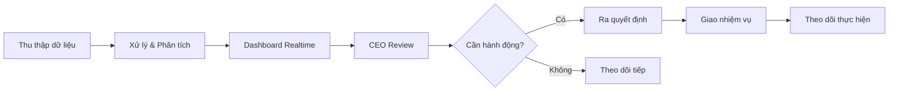
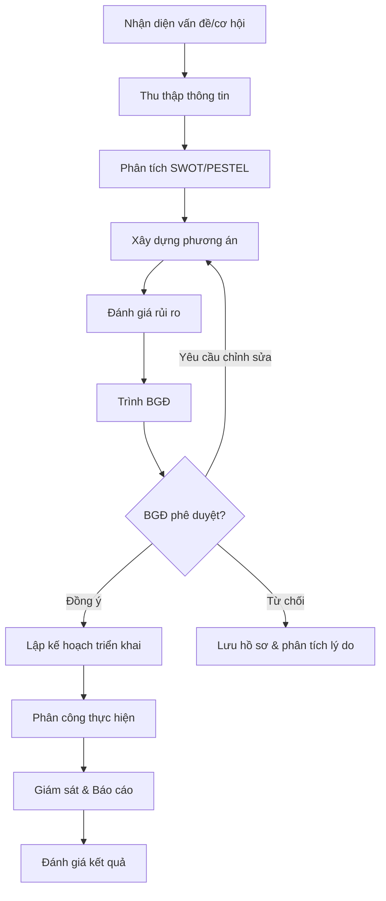
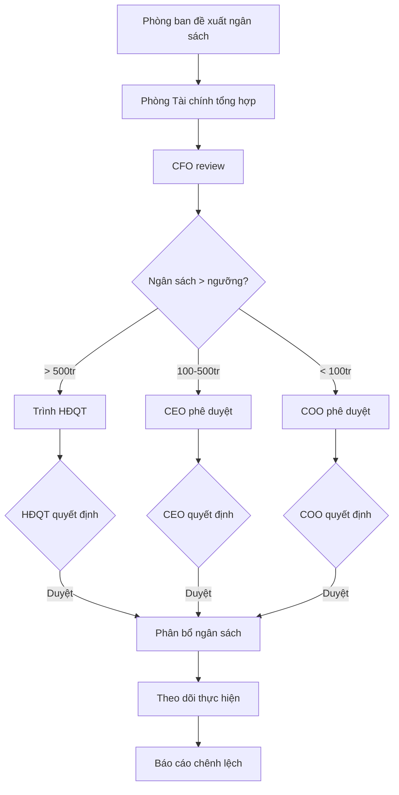
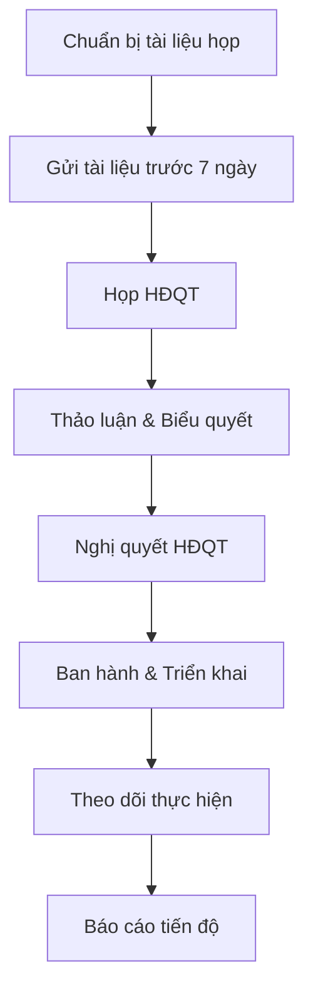

# CEO & Ban Giám đốc - ERP Module

## Tổng quan vai trò
CEO và Ban Giám đốc (BGĐ) là cấp điều hành cao nhất, chịu trách nhiệm định hướng chiến lược, ra quyết định kinh doanh, giám sát toàn bộ hoạt động doanh nghiệp thông qua hệ thống ERP.

## Cơ cấu tổ chức Ban Giám đốc

| Vai trò | Tiếng Việt | Trách nhiệm chính |
|---------|-----------|-------------------|
| CEO | Tổng Giám đốc | Điều hành toàn bộ, chiến lược tổng thể |
| COO | Phó TGĐ Vận hành | Giám sát hoạt động hàng ngày |
| CFO | Giám đốc Tài chính | Tài chính, ngân sách, đầu tư |
| CMO | Giám đốc Marketing | Chiến lược marketing & branding |
| CHRO | Giám đốc Nhân sự | Quản lý nhân lực, văn hóa DN |
| CTO | Giám đốc Công nghệ | Hạ tầng CNTT, chuyển đổi số |
| CSO | Giám đốc Kinh doanh | Chiến lược bán hàng, doanh thu |

## Quy trình nghiệp vụ

### 1. Dashboard điều hành (Executive Dashboard)



#### Các chỉ số trên Dashboard
| Nhóm | Chỉ số | Nguồn dữ liệu |
|------|--------|---------------|
| Doanh thu | Doanh thu ngày/tuần/tháng/năm | Module Sales |
| Chi phí | Tổng chi phí theo danh mục | Module Finance |
| Nhân sự | Tổng nhân viên, tuyển mới, nghỉ việc | Module HR |
| Khách hàng | Số KH mới, churn rate, satisfaction | Module CRM |
| Sản xuất | Tiến độ dự án, năng suất | Module Planning |
| Tài chính | Cash flow, P&L, ROI | Module Accounting |
| Marketing | Lead count, conversion rate, CAC | Module Marketing |
| Kho | Tồn kho, vòng quay hàng tồn | Module Procurement |

### 2. Quy trình Ra quyết định Chiến lược



### 3. Quản trị Rủi ro Doanh nghiệp

#### Ma trận rủi ro
| Mức độ tác động | Xác suất thấp | Xác suất TB | Xác suất cao |
|----------------|--------------|------------|-------------|
| **Nghiêm trọng** | Theo dõi | Phòng ngừa | Hành động ngay |
| **Cao** | Theo dõi | Phòng ngừa | Lập kế hoạch |
| **Trung bình** | Chấp nhận | Theo dõi | Phòng ngừa |
| **Thấp** | Chấp nhận | Chấp nhận | Theo dõi |

#### Danh mục rủi ro
```
Rủi ro doanh nghiệp
├── Rủi ro tài chính
│   ├── Thanh khoản
│   ├── Tín dụng
│   └── Tỷ giá
├── Rủi ro vận hành
│   ├── Quy trình
│   ├── Nhân sự
│   └── Công nghệ
├── Rủi ro thị trường
│   ├── Cạnh tranh
│   ├── Nhu cầu
│   └── Giá cả
├── Rủi ro pháp lý
│   ├── Tuân thủ
│   ├── Hợp đồng
│   └── Tranh chấp
└── Rủi ro chiến lược
    ├── Định hướng
    ├── Đầu tư
    └── M&A
```

### 4. Phê duyệt Ngân sách & Kế hoạch



#### Phân cấp phê duyệt
| Hạng mục | COO | CEO | HĐQT |
|----------|-----|-----|------|
| Chi phí vận hành | < 100 triệu | 100-500 triệu | > 500 triệu |
| Đầu tư tài sản | < 50 triệu | 50-300 triệu | > 300 triệu |
| Tuyển dụng | Nhân viên | Quản lý | C-Level |
| Hợp đồng | < 200 triệu | 200-1 tỷ | > 1 tỷ |
| Vay vốn | - | < 1 tỷ | > 1 tỷ |

### 5. Hệ thống Báo cáo Quản trị

#### Balanced Scorecard (BSC)
| Viễn cảnh | Mục tiêu | Chỉ số (KPI) | Mục tiêu | Sáng kiến |
|-----------|---------|-------------|---------|-----------|
| Tài chính | Tăng trưởng doanh thu | Tăng trưởng YoY | 20% | Mở rộng thị trường |
| Tài chính | Tối ưu chi phí | Tỷ lệ chi phí/doanh thu | < 70% | Tự động hóa quy trình |
| Khách hàng | Nâng cao hài lòng | NPS Score | > 50 | Cải thiện dịch vụ |
| Khách hàng | Giữ chân KH | Retention Rate | > 85% | Chương trình loyalty |
| Quy trình | Hiệu quả vận hành | Process Cycle Time | Giảm 30% | Lean Six Sigma |
| Quy trình | Chất lượng SP/DV | Defect Rate | < 1% | QC automation |
| Học hỏi & PT | Phát triển nhân sự | Training hours/NV | 40h/năm | E-learning platform |
| Học hỏi & PT | Đổi mới sáng tạo | Số sáng kiến/quý | > 10 | Innovation program |

#### OKR Template
```markdown
## OKR Quý [Q1/Q2/Q3/Q4] - [Năm]

### Objective 1: [Mục tiêu chiến lược]
- KR1: [Kết quả đo lường] - Target: [con số]
- KR2: [Kết quả đo lường] - Target: [con số]
- KR3: [Kết quả đo lường] - Target: [con số]

### Objective 2: [Mục tiêu]
- KR1: ...
```

### 6. Quy trình Hội đồng Quản trị



#### Các cuộc họp định kỳ
| Loại họp | Tần suất | Thành phần | Nội dung chính |
|----------|---------|-----------|---------------|
| Họp HĐQT | Quý | HĐQT + CEO | Chiến lược, tài chính, nhân sự cấp cao |
| Họp Ban điều hành | Tuần | BGĐ | Vận hành, vấn đề phát sinh, KPIs |
| Họp giao ban | Ngày (5-10p) | BGĐ + Trưởng phòng | Cập nhật nhanh, vấn đề cần giải quyết |
| Họp chiến lược | 6 tháng | HĐQT + BGĐ | Đánh giá chiến lược, điều chỉnh |
| Tổng kết năm | Năm | Toàn công ty | Kết quả, khen thưởng, kế hoạch năm mới |

## Modules ERP liên quan

| Module | Mối quan hệ với CEO |
|--------|---------------------|
| Finance | Duyệt ngân sách, xem báo cáo tài chính |
| HR | Tuyển dụng cấp cao, chính sách nhân sự |
| Sales | Mục tiêu doanh số, KPIs kinh doanh |
| Marketing | Chiến lược thương hiệu, ngân sách MKT |
| Planning | Phê duyệt kế hoạch, theo dõi OKR |
| All Modules | Dashboard tổng hợp, báo cáo cross-module |

## Quyền hạn trong ERP

| Chức năng | CEO | COO | CFO | CMO | CHRO |
|-----------|-----|-----|-----|-----|------|
| Dashboard tổng quan | Full | Full | Tài chính | Marketing | HR |
| Phê duyệt ngân sách | Full | < 100tr | Đề xuất | Phòng MKT | Phòng HR |
| Xem báo cáo | Tất cả | Vận hành | Tài chính | Marketing | Nhân sự |
| Quản lý nhân sự | C-Level | Quản lý | - | - | Full |
| Cấu hình hệ thống | Full | Giới hạn | - | - | - |
