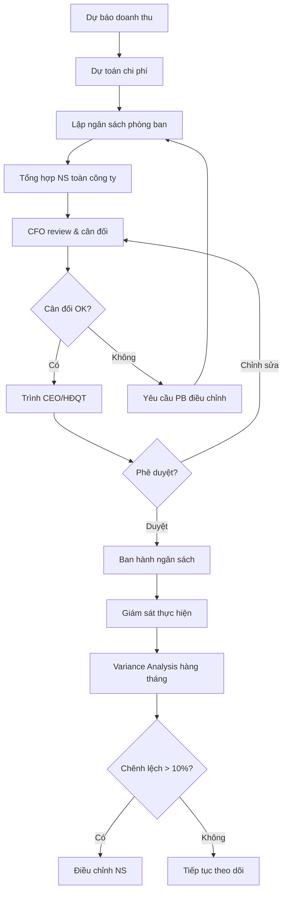
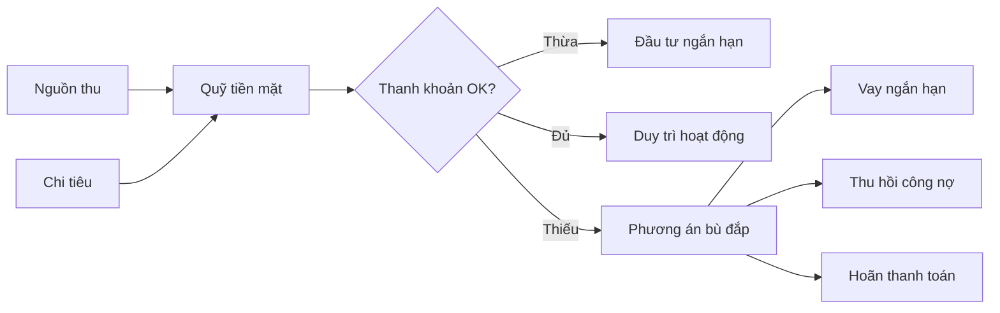
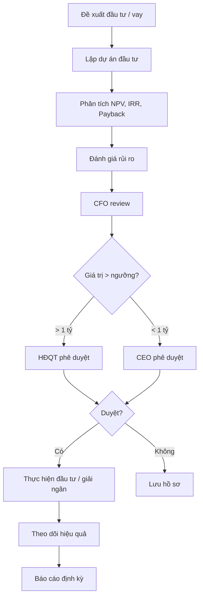
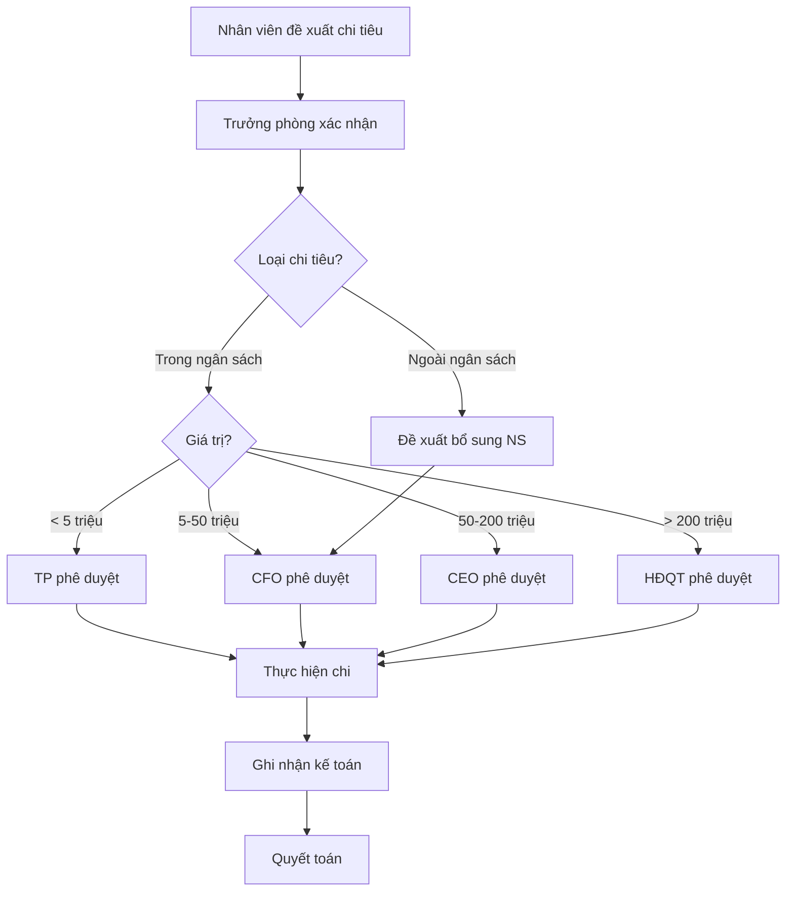

# Tài chính - ERP Module

## Tổng quan
Phòng Tài chính chịu trách nhiệm quản lý nguồn vốn, dòng tiền, phân tích tài chính, lập ngân sách, quản lý rủi ro tài chính, và đảm bảo sức khỏe tài chính doanh nghiệp.

## Vai trò & Nhân sự

| Vai trò | Trách nhiệm |
|---------|-------------|
| CFO / Giám đốc Tài chính | Chiến lược tài chính, quan hệ ngân hàng, đầu tư |
| Finance Manager | Quản lý team, lập ngân sách, báo cáo |
| Financial Analyst | Phân tích tài chính, dự báo, mô hình |
| Treasury Specialist | Quản lý tiền mặt, thanh khoản |
| Credit Controller | Quản lý công nợ, đánh giá tín dụng |
| Investment Analyst | Phân tích đầu tư, ROI, thẩm định |
| Compliance Officer | Tuân thủ quy định tài chính |

## Quy trình nghiệp vụ

### 1. Quản lý Ngân sách & Dự toán



#### Cấu trúc Ngân sách
```
Ngân sách Tổng
├── Ngân sách Doanh thu (Revenue Budget)
│   ├── Doanh thu bán hàng
│   ├── Doanh thu dịch vụ
│   └── Doanh thu khác
├── Ngân sách Chi phí (Cost Budget)
│   ├── COGS (Giá vốn hàng bán)
│   ├── Chi phí bán hàng
│   ├── Chi phí quản lý
│   └── Chi phí tài chính
├── Ngân sách Đầu tư (CapEx Budget)
│   ├── Tài sản cố định
│   ├── Đầu tư công nghệ
│   └── Mở rộng kinh doanh
└── Ngân sách Vốn (Capital Budget)
    ├── Vốn chủ sở hữu
    ├── Vay ngân hàng
    └── Phát hành trái phiếu
```

### 2. Quản lý Dòng tiền (Cash Flow)



#### Cash Flow Forecast Template
| Tuần | Thu dự kiến | Chi dự kiến | Số dư cuối kỳ | Trạng thái |
|------|-----------|-----------|--------------|-----------|
| W1 | [Thu] | [Chi] | [Dư] | 🟢/🟡/🔴 |
| W2 | [Thu] | [Chi] | [Dư] | 🟢/🟡/🔴 |
| ... | ... | ... | ... | ... |

### 3. Phân tích Tài chính

#### Báo cáo P&L (Profit & Loss)
| Khoản mục | Tháng này | Lũy kế | Kế hoạch | % Thực hiện |
|-----------|----------|--------|---------|------------|
| Doanh thu thuần | | | | |
| (-) Giá vốn hàng bán | | | | |
| = **Lợi nhuận gộp** | | | | |
| (-) Chi phí bán hàng | | | | |
| (-) Chi phí QLDN | | | | |
| = **Lợi nhuận HĐKD** | | | | |
| (+/-) Thu nhập/chi phí khác | | | | |
| = **Lợi nhuận trước thuế** | | | | |
| (-) Thuế TNDN | | | | |
| = **Lợi nhuận sau thuế** | | | | |

#### Chỉ số Tài chính Quan trọng
| Nhóm | Chỉ số | Công thức | Target |
|------|--------|----------|--------|
| Thanh khoản | Current Ratio | TSNH / Nợ NH | > 1.5 |
| Thanh khoản | Quick Ratio | (TSNH - HTK) / Nợ NH | > 1.0 |
| Hiệu quả | ROE | LN sau thuế / VCSH | > 15% |
| Hiệu quả | ROA | LN sau thuế / Tổng TS | > 8% |
| Hiệu quả | ROI | (Lãi - Vốn) / Vốn | > 20% |
| Đòn bẩy | Debt/Equity | Tổng nợ / VCSH | < 2.0 |
| Hoạt động | Vòng quay tồn kho | GVHB / HTK TB | > 6x |
| Hoạt động | DSO | AR / (DT/365) | < 45 ngày |
| Hoạt động | DPO | AP / (GVHB/365) | 30-60 ngày |
| Lợi nhuận | Gross Margin | LN gộp / DT | > 30% |
| Lợi nhuận | Net Margin | LN ròng / DT | > 10% |
| Lợi nhuận | EBITDA Margin | EBITDA / DT | > 20% |

### 4. Quản lý Đầu tư & Vay vốn



#### Tiêu chí Đánh giá Đầu tư
| Chỉ tiêu | Ngưỡng chấp nhận | Ý nghĩa |
|----------|-----------------|---------|
| NPV | > 0 | Dự án tạo giá trị |
| IRR | > WACC (12-15%) | Suất sinh lời chấp nhận |
| Payback Period | < 3 năm | Thời gian hoàn vốn |
| ROI | > 20% | Hiệu quả đầu tư |
| Risk Score | < 7/10 | Mức rủi ro chấp nhận |

### 5. Quản lý Công nợ Tổng hợp

| Loại công nợ | Theo dõi | Trách nhiệm | Tần suất đối chiếu |
|-------------|---------|-------------|-------------------|
| Phải thu KH | Theo KH + HĐ | Credit Controller | Hàng tuần |
| Phải trả NCC | Theo NCC + HĐ | AP Team | Hàng tuần |
| Vay ngân hàng | Theo khoản vay | Treasury | Hàng tháng |
| Thuế phải nộp | Theo sắc thuế | Tax Accountant | Hàng tháng |
| Lương phải trả | Theo tháng | Payroll | Hàng tháng |

### 6. Quy trình Phê duyệt Chi tiêu



### 7. Báo cáo Tài chính

#### Bộ Báo cáo Tài chính theo VAS (Chuẩn kế toán Việt Nam)
| STT | Báo cáo | Mã biểu | Tần suất |
|-----|---------|---------|---------|
| 1 | Bảng cân đối kế toán | B01-DN | Quý / Năm |
| 2 | Báo cáo kết quả HĐKD | B02-DN | Quý / Năm |
| 3 | Báo cáo lưu chuyển tiền tệ | B03-DN | Quý / Năm |
| 4 | Thuyết minh BCTC | B09-DN | Năm |

#### Báo cáo Quản trị
| Báo cáo | Tần suất | Người nhận |
|---------|---------|-----------|
| Cash flow hàng ngày | Ngày | CFO |
| Báo cáo công nợ | Tuần | CFO, Sales |
| P&L tháng | Tháng | BGĐ |
| Phân tích variance | Tháng | CFO, CEO |
| Financial KPIs | Quý | HĐQT |
| Báo cáo đầu tư | Quý | HĐQT |

## Quyền hạn trong ERP

| Chức năng | CFO | Fin Manager | Analyst | Treasury | Credit |
|-----------|-----|-----------|---------|---------|--------|
| Ngân sách | Full | Lập/Sửa | Phân tích | Xem | Xem |
| Phê duyệt chi | > 50tr | Đề xuất | Không | Không | Không |
| Dòng tiền | Full | Xem | Phân tích | Quản lý | Xem |
| Đầu tư | Phê duyệt | Phân tích | Phân tích | Không | Không |
| Công nợ | Full | Xem tất cả | Phân tích | Xem | Quản lý |
| BCTC | Full | Lập | Hỗ trợ | Không | Không |
