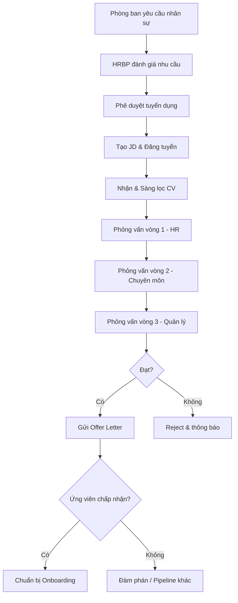
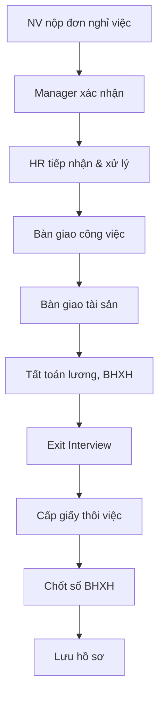
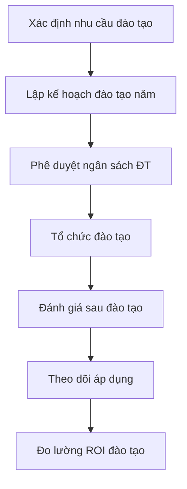
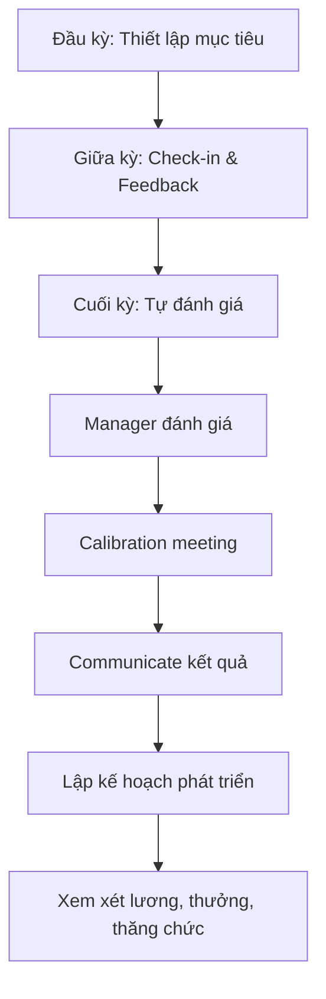
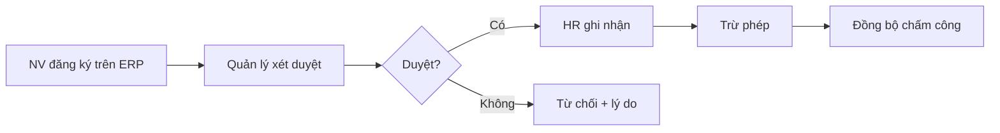

# Nhân sự (HR) - ERP Module

## Tổng quan
Phòng Nhân sự (HR) chịu trách nhiệm quản lý toàn bộ vòng đời nhân viên từ tuyển dụng, onboarding, phát triển nghề nghiệp, đánh giá hiệu suất đến nghỉ việc, đảm bảo tuân thủ Bộ luật Lao động Việt Nam.

## Vai trò & Nhân sự

| Vai trò | Trách nhiệm |
|---------|-------------|
| CHRO / Giám đốc Nhân sự | Chiến lược nhân sự, văn hóa DN, cơ cấu tổ chức |
| HR Manager | Quản lý team HR, chính sách, quy trình |
| Recruitment Specialist | Tuyển dụng, phỏng vấn, sourcing |
| HR Generalist | Hồ sơ NV, hợp đồng LĐ, chế độ |
| Training & Development | Đào tạo, phát triển năng lực |
| C&B Specialist | Lương thưởng, phúc lợi, BHXH |
| Employee Relations | Quan hệ lao động, kỷ luật, giải quyết tranh chấp |
| HR Admin | Hành chính nhân sự, thủ tục |

## Quy trình nghiệp vụ

### 1. Quản lý Hồ sơ Nhân sự

#### Thông tin Hồ sơ Nhân viên
```
Hồ sơ Nhân viên
├── Thông tin Cá nhân
│   ├── Họ tên, ngày sinh, giới tính
│   ├── CMND/CCCD, ngày cấp, nơi cấp
│   ├── Địa chỉ thường trú & tạm trú
│   ├── Số điện thoại, email
│   ├── Tình trạng hôn nhân
│   └── Người phụ thuộc (giảm trừ thuế)
├── Thông tin Công việc
│   ├── Mã nhân viên
│   ├── Phòng ban, chức vụ, vị trí
│   ├── Ngày vào làm
│   ├── Loại hợp đồng LĐ
│   ├── Mức lương, phụ cấp
│   └── Quản lý trực tiếp
├── Trình độ & Bằng cấp
│   ├── Học vấn (Đại học, Thạc sĩ...)
│   ├── Chứng chỉ chuyên môn
│   ├── Ngoại ngữ
│   └── Kỹ năng tin học
├── Hồ sơ Pháp lý
│   ├── Sơ yếu lý lịch có xác nhận
│   ├── Giấy khám sức khỏe
│   ├── Sổ BHXH
│   └── MST cá nhân
└── Lịch sử Công tác
    ├── Thăng chức, chuyển phòng
    ├── Khen thưởng, kỷ luật
    ├── Đào tạo đã tham gia
    └── Đánh giá hiệu suất
```

### 2. Quy trình Tuyển dụng (Recruitment Pipeline)



#### Recruitment Funnel Metrics
| Giai đoạn | Metric | Target |
|-----------|--------|--------|
| Sourcing | Số CV nhận/kênh | ≥ 50 CV/vị trí |
| Screening | CV pass rate | 30-40% |
| Interview 1 | Pass rate | 50% |
| Interview 2 | Pass rate | 60% |
| Interview 3 | Pass rate | 70% |
| Offer | Acceptance rate | ≥ 80% |
| **Overall** | **Time to hire** | **< 30 ngày** |
| **Overall** | **Cost per hire** | **< 5 triệu VNĐ** |

### 3. Onboarding & Offboarding

#### Onboarding Checklist (Trước ngày nhận việc)
| Hạng mục | Trách nhiệm | Timeline |
|----------|-------------|---------|
| Chuẩn bị bàn/ghế, thiết bị | Admin | -3 ngày |
| Tạo tài khoản email, ERP | IT | -2 ngày |
| Chuẩn bị thẻ nhân viên | HR | -1 ngày |
| Soạn hợp đồng LĐ | HR | -3 ngày |
| Thông báo team | Manager | -1 ngày |

#### Onboarding Checklist (Tuần đầu tiên)
| Ngày | Nội dung | Phụ trách |
|------|---------|----------|
| Ngày 1 | Đón tiếp, giới thiệu công ty, chính sách | HR |
| Ngày 1 | Ký hợp đồng, nội quy | HR |
| Ngày 2 | Training sản phẩm/dịch vụ | Team |
| Ngày 3 | Training quy trình & tools | Manager |
| Ngày 4-5 | Buddy system, shadowing | Buddy |

#### Offboarding Checklist


### 4. Hợp đồng Lao động

#### Theo Bộ luật Lao động 2019
| Loại HĐ | Thời hạn | Thử việc | Ghi chú |
|---------|---------|---------|---------|
| HĐ thử việc | ≤ 180 ngày (QL) / ≤ 60 ngày | - | Lương ≥ 85% chính thức |
| HĐ xác định thời hạn | ≤ 36 tháng | Có | Ký tối đa 2 lần |
| HĐ không xác định thời hạn | Vô thời hạn | Có | Sau 2 lần HĐ XĐTH |

#### Nội dung bắt buộc trong HĐLĐ
- Tên, địa chỉ người sử dụng lao động
- Họ tên, CCCD, địa chỉ người lao động
- Công việc và địa điểm làm việc
- Thời hạn hợp đồng
- Mức lương, hình thức trả lương, thời hạn trả
- Chế độ nâng bậc, nâng lương
- Thời giờ làm việc, nghỉ ngơi
- Trang bị BHLĐ
- BHXH, BHYT, BHTN
- Đào tạo, bồi dưỡng

### 5. Đào tạo & Phát triển Nhân viên



#### Ma trận Đào tạo
| Cấp bậc | Kỹ năng cứng | Kỹ năng mềm | Leadership |
|---------|-------------|-------------|-----------|
| Nhân viên mới | Onboarding, sản phẩm | Giao tiếp, teamwork | - |
| Nhân viên | Chuyên môn sâu | Thuyết trình, đàm phán | - |
| Team Lead | Advanced technical | Coaching, conflict mgmt | Team leadership |
| Manager | Strategic thinking | Influencing, negotiation | People management |
| Director+ | Industry expertise | Executive presence | Organizational leadership |

### 6. Đánh giá Hiệu suất (Performance Review)



#### Thang Đánh giá
| Mức | Điểm | Mô tả | % target |
|-----|------|--------|---------|
| Outstanding | 5 | Vượt xa kỳ vọng | > 120% |
| Exceeds | 4 | Vượt kỳ vọng | 110-120% |
| Meets | 3 | Đạt kỳ vọng | 90-110% |
| Below | 2 | Dưới kỳ vọng | 70-90% |
| Unsatisfactory | 1 | Không đạt | < 70% |

#### 9-Box Grid (Talent Matrix)
```
         │ Potential
         │ High    │ Medium   │ Low
─────────┼─────────┼──────────┼──────────
Perf High│ Star    │ Consistent│ Expert
─────────┼─────────┼──────────┼──────────
Perf Med │ Growth  │ Core     │ Effective
─────────┼─────────┼──────────┼──────────
Perf Low │ Enigma  │ Improve  │ Action
```

### 7. Chính sách Lương thưởng & Phúc lợi (C&B)

#### Cấu trúc Thu nhập
| Khoản mục | Mô tả | Thuế TNCN |
|-----------|--------|----------|
| Lương cơ bản | Theo HĐLĐ | Chịu thuế |
| Phụ cấp trách nhiệm | Theo chức vụ | Chịu thuế |
| Phụ cấp ăn trưa | ≤ 730K/tháng | Miễn thuế ≤ 730K |
| Phụ cấp đi lại | Theo quy định | Chịu thuế |
| Phụ cấp điện thoại | Theo quy định | Chịu thuế |
| Thưởng KPI | Theo kết quả | Chịu thuế |
| Thưởng tháng 13 | 1 tháng lương | Chịu thuế |
| Thưởng đặc biệt | Case-by-case | Chịu thuế |

#### Chế độ Phúc lợi
| Phúc lợi | Mô tả |
|----------|--------|
| BHXH, BHYT, BHTN | Theo quy định nhà nước |
| Bảo hiểm sức khỏe | Gói premium bổ sung |
| Khám sức khỏe | Hàng năm |
| Du lịch công ty | 1-2 lần/năm |
| Teambuilding | Hàng quý |
| Học phí hỗ trợ | Tối đa XX triệu/năm |
| Sinh nhật nhân viên | Quà tặng + nửa ngày nghỉ |
| Hiếu, hỷ | Trợ cấp theo quy chế |

### 8. Quản lý Nghỉ phép

#### Theo Bộ luật Lao động 2019
| Loại nghỉ | Số ngày/năm | Lương |
|-----------|------------|-------|
| Phép năm | 12 ngày (tăng theo thâm niên) | 100% |
| Nghỉ lễ, tết | 11 ngày/năm | 100% |
| Việc riêng (cưới, tang) | 1-3 ngày | 100% |
| Thai sản (nữ) | 6 tháng | BHXH chi trả |
| Thai sản (nam) | 5-14 ngày | BHXH chi trả |
| Ốm đau | Theo BHXH | 75% (BHXH) |
| Nghỉ không lương | Thỏa thuận | 0% |

#### Quy trình Đăng ký Nghỉ phép


## KPIs Phòng HR

| KPI | Công thức | Target |
|-----|----------|--------|
| Turnover Rate | NV nghỉ / Tổng NV × 100% | < 15%/năm |
| Time to Hire | Ngày từ đăng tuyển → nhận việc | < 30 ngày |
| Cost per Hire | Tổng chi tuyển dụng / Số tuyển | < 5 triệu |
| eNPS | % Promoters - % Detractors | > 30 |
| Training Hours | Giờ ĐT / NV / năm | ≥ 40 giờ |
| Absenteeism Rate | Ngày vắng / Tổng ngày làm | < 3% |
| Offer Acceptance | Offer chấp nhận / Tổng offer | > 80% |
| Retention Rate (New) | NV mới ở > 1 năm | > 85% |

## Quyền hạn trong ERP

| Chức năng | CHRO | HR Manager | Recruiter | HR Generalist | C&B |
|-----------|------|-----------|----------|-------------|-----|
| Hồ sơ NV | Full | Full | Ứng viên | Phân quyền | Lương |
| Tuyển dụng | Phê duyệt | Quản lý | Thực hiện | Không | Không |
| Hợp đồng LĐ | Ký | Lập | Không | Lập | Không |
| Đánh giá | Calibration | Tổng hợp | Không | Hỗ trợ | Không |
| Lương thưởng | Phê duyệt | Đề xuất | Không | Không | Tính toán |
| Nghỉ phép | Xem all | Xem all | Không | Quản lý | Không |
| Đào tạo | Phê duyệt NS | Lập KH | Không | Hỗ trợ | Không |
