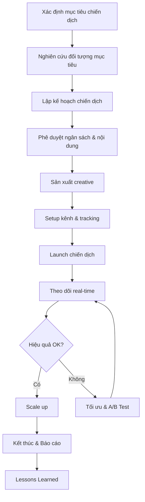
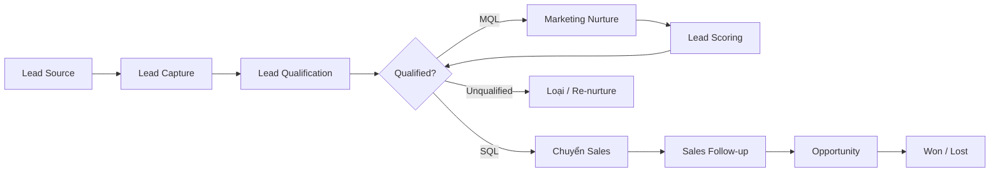
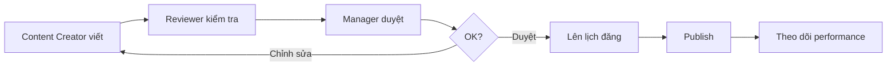
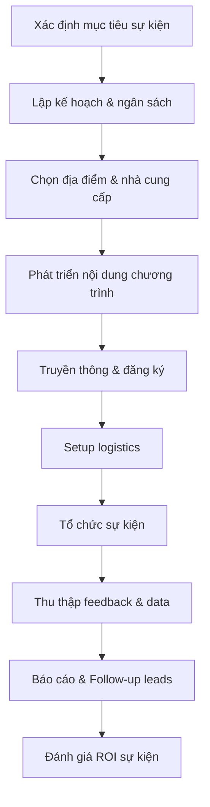

# Marketing - ERP Module

## Tổng quan
Phòng Marketing chịu trách nhiệm xây dựng thương hiệu, tạo nguồn khách hàng tiềm năng (leads), triển khai chiến dịch marketing đa kênh, và đo lường hiệu quả đầu tư marketing.

## Vai trò & Nhân sự

| Vai trò | Trách nhiệm |
|---------|-------------|
| CMO / Giám đốc Marketing | Chiến lược MKT tổng thể, ngân sách |
| Marketing Manager | Quản lý team, điều phối chiến dịch |
| Digital Marketing Specialist | SEO/SEM, Google Ads, Facebook Ads |
| Content Creator | Sáng tạo nội dung, copywriting |
| Social Media Manager | Quản lý kênh social, community |
| Event Coordinator | Tổ chức sự kiện, hội thảo |
| Marketing Analyst | Phân tích data, đo ROI |
| Graphic Designer | Thiết kế visual, brand assets |

## Quy trình nghiệp vụ

### 1. Quản lý Chiến dịch Marketing



#### Template Kế hoạch Chiến dịch
```markdown
# Chiến dịch: [Tên]
- **Mục tiêu**: [SMART Goal]
- **Đối tượng**: [Persona / Segment]
- **Kênh**: [Online/Offline channels]
- **Ngân sách**: [Tổng & phân bổ theo kênh]
- **Timeline**: [Ngày bắt đầu - Kết thúc]
- **KPIs**: [Impressions, Clicks, Leads, Conversions]
- **Responsible**: [Team members]
```

### 2. CRM & Quản lý Lead Pipeline



#### Lead Scoring Model
| Tiêu chí | Điểm | Mô tả |
|----------|------|--------|
| Chức vụ C-Level | +30 | Ra quyết định |
| Chức vụ Manager | +20 | Ảnh hưởng quyết định |
| Doanh nghiệp > 100 NV | +15 | Quy mô phù hợp |
| Download tài liệu | +10 | Quan tâm nội dung |
| Tham dự webinar | +15 | Tương tác cao |
| Mở email > 3 lần | +5 | Theo dõi thường xuyên |
| Truy cập trang giá | +20 | Có ý định mua |
| Không tương tác 30 ngày | -20 | Mất quan tâm |
| **MQL Threshold** | **≥ 50** | Chuyển nurture pipeline |
| **SQL Threshold** | **≥ 80** | Chuyển Sales |

#### Trạng thái Lead trong CRM
| Trạng thái | Mô tả | Hành động tiếp |
|-----------|--------|----------------|
| New | Lead mới từ bất kỳ nguồn nào | Phân loại trong 24h |
| Contacted | Đã liên hệ lần đầu | Follow-up trong 48h |
| Engaged | Đang tương tác | Nurture content |
| MQL | Marketing Qualified Lead | Marketing nurture |
| SQL | Sales Qualified Lead | Chuyển Sales |
| Opportunity | Đang đàm phán | Sales process |
| Won | Thành công | Onboarding KH |
| Lost | Thất bại | Phân tích lý do |
| Recycled | Nurture lại | Re-engagement campaign |

### 3. Quản lý Nội dung & Social Media

#### Content Calendar
| Kênh | Tần suất | Loại nội dung | Mục tiêu |
|------|---------|--------------|---------|
| Facebook | 5 bài/tuần | Mix: image, video, article | Engagement, brand awareness |
| Instagram | 3 bài/tuần | Visual: reels, stories, posts | Brand image, younger audience |
| LinkedIn | 3 bài/tuần | Professional: case study, insight | B2B leads, thought leadership |
| YouTube | 2 video/tháng | Tutorial, behind-the-scenes | Education, SEO |
| Blog/Website | 4 bài/tháng | SEO articles, guides | Organic traffic, authority |
| TikTok | 5 video/tuần | Short-form, trending | Brand awareness, Gen Z |
| Email | 2 lần/tuần | Newsletter, promo | Nurture, conversion |
| Zalo OA | 3 bài/tuần | Tin tức, khuyến mãi | KH Việt Nam |

#### Quy trình Duyệt nội dung


### 4. Phân tích ROI Chiến dịch

#### Marketing Metrics Dashboard
| Metric | Công thức | Target |
|--------|----------|--------|
| CAC (Customer Acquisition Cost) | Tổng chi MKT / Số KH mới | < 500K VNĐ |
| ROAS (Return on Ad Spend) | Doanh thu từ ads / Chi phí ads | > 4x |
| CPL (Cost per Lead) | Chi phí MKT / Số leads | < 100K VNĐ |
| Conversion Rate | Leads → KH / Tổng leads | > 5% |
| CLV (Customer Lifetime Value) | ARPU × Thời gian gắn bó | > 10x CAC |
| Email Open Rate | Emails mở / Emails gửi | > 25% |
| CTR (Click-through Rate) | Clicks / Impressions | > 2% |
| Social Engagement Rate | Tương tác / Followers | > 3% |
| Organic Traffic Growth | MoM increase | > 10% |
| Brand Awareness | Survey-based | Tăng QoQ |

### 5. Quản lý Sự kiện & Hội thảo



### 6. Email Marketing & Automation

#### Automation Workflows
| Workflow | Trigger | Chuỗi email | Mục tiêu |
|----------|---------|------------|---------|
| Welcome Series | Đăng ký mới | 5 emails / 14 ngày | Giới thiệu, engage |
| Lead Nurturing | Download tài liệu | 7 emails / 30 ngày | Chuyển MQL → SQL |
| Abandoned Cart | Bỏ giỏ hàng | 3 emails / 7 ngày | Recover purchase |
| Re-engagement | Không tương tác 60 ngày | 3 emails / 14 ngày | Kích hoạt lại |
| Post-purchase | Mua hàng thành công | 4 emails / 30 ngày | Upsell, loyalty |
| Event Follow-up | Tham dự sự kiện | 3 emails / 7 ngày | Convert attendees |

### 7. Quản lý Ngân sách Marketing

| Kênh | Tỷ trọng | Theo dõi |
|------|---------|---------|
| Digital Ads (Google, FB) | 35% | CPL, ROAS, CPC |
| Content Marketing | 15% | Traffic, leads, engagement |
| Events & Sponsorship | 20% | Leads, brand exposure |
| PR & Media | 10% | Coverage, sentiment |
| Email & CRM Tools | 5% | Subcribers, conversion |
| Branding & Design | 10% | Brand metrics |
| Dự phòng | 5% | - |

## Quyền hạn trong ERP

| Chức năng | CMO | MKT Manager | Specialist | Content Creator |
|-----------|-----|------------|-----------|----------------|
| Chiến lược MKT | Full | Đề xuất | Xem | Không |
| Ngân sách | Phê duyệt | Quản lý | Theo dõi | Không |
| Chiến dịch | Phê duyệt | Tạo/Quản lý | Thực hiện | Hỗ trợ content |
| CRM/Leads | Full | Full | Leads phụ trách | Không |
| Báo cáo | Tất cả | Phòng MKT | Kênh phụ trách | Nội dung |
| Nội dung | Duyệt cuối | Duyệt | Tạo | Tạo |
