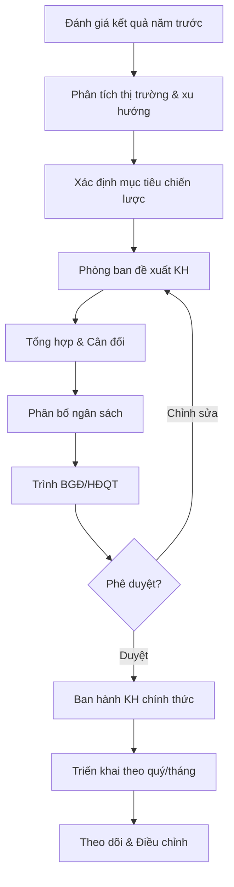
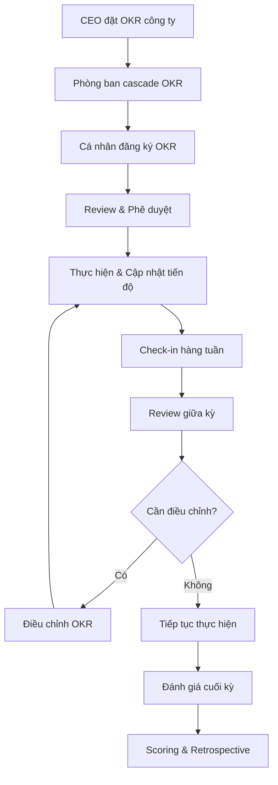
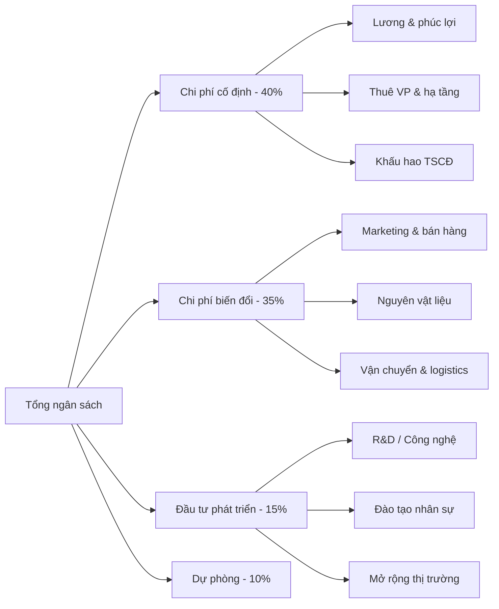
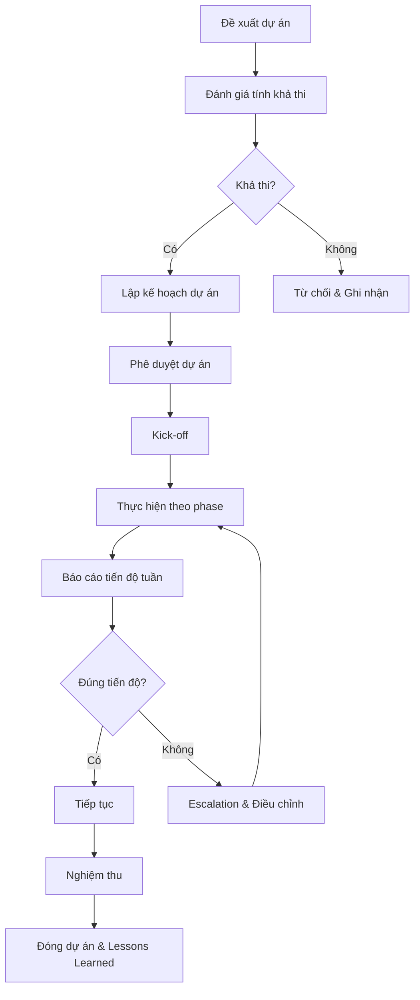
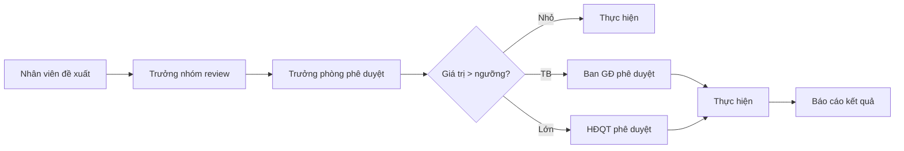

# Kế hoạch & Chiến lược - ERP Module

## Tổng quan
Phòng Kế hoạch & Chiến lược chịu trách nhiệm xây dựng kế hoạch kinh doanh, theo dõi mục tiêu chiến lược, phân bổ nguồn lực, và đánh giá hiệu quả hoạt động toàn doanh nghiệp.

## Vai trò & Nhân sự

| Vai trò | Trách nhiệm |
|---------|-------------|
| Giám đốc Chiến lược | Định hướng chiến lược, phối hợp BGĐ |
| Trưởng phòng Kế hoạch | Lập KH kinh doanh, phân bổ ngân sách |
| Chuyên viên Kế hoạch | Tổng hợp kế hoạch phòng ban, theo dõi tiến độ |
| Chuyên viên Phân tích | Phân tích dữ liệu, báo cáo hiệu quả |
| Chuyên viên Dự án | Quản lý dự án nội bộ, PMO |

## Quy trình nghiệp vụ

### 1. Lập Kế hoạch Kinh doanh Hàng năm



#### Nội dung Kế hoạch Kinh doanh
```markdown
# Kế hoạch Kinh doanh [Năm]

## 1. Tầm nhìn & Sứ mệnh
## 2. Phân tích Môi trường
  - SWOT Analysis
  - PESTEL Analysis
  - Porter's Five Forces
## 3. Mục tiêu Chiến lược
  - Định lượng (doanh thu, lợi nhuận, thị phần)
  - Định tính (thương hiệu, năng lực, văn hóa)
## 4. Kế hoạch Hành động theo Phòng ban
## 5. Phân bổ Ngân sách
## 6. Timeline & Milestones
## 7. KPIs & Cơ chế Đánh giá
## 8. Phương án Dự phòng
```

### 2. Quản lý OKR/KPI theo Phòng ban



#### KPIs theo Phòng ban
| Phòng ban | KPI chính | Đơn vị | Tần suất đo |
|-----------|----------|--------|------------|
| Sales | Doanh thu, số HĐ mới, conversion rate | VNĐ, %, số | Tuần |
| Marketing | Leads, CAC, brand awareness | Số, VNĐ, % | Tháng |
| Finance | Cash flow, ROI, chi phí/DT | VNĐ, % | Tháng |
| HR | Turnover rate, time-to-hire, eNPS | %, ngày, điểm | Quý |
| Accounting | Accuracy rate, closing time | %, ngày | Tháng |
| Admin | SLA compliance, cost savings | %, VNĐ | Quý |
| Procurement | Cost savings, supplier score | %, điểm | Quý |

### 3. Phân bổ Ngân sách theo Dự án/Phòng ban



#### Quy trình Phê duyệt Ngân sách
| Bước | Người thực hiện | Thời gian | Output |
|------|----------------|----------|--------|
| 1. Đề xuất | Trưởng phòng | T10 | Bản đề xuất NS |
| 2. Tổng hợp | Phòng KH | T11 đầu | Bản tổng hợp |
| 3. Cân đối | CFO + Phòng KH | T11 giữa | Bản cân đối |
| 4. Phê duyệt | CEO/HĐQT | T12 đầu | Nghị quyết NS |
| 5. Ban hành | Phòng KH | T12 giữa | KH ngân sách chính thức |

### 4. Quản lý Dự án Nội bộ (PMO)



#### Template Gantt Chart
| Task | Người PTV | W1 | W2 | W3 | W4 | W5 | W6 | W7 | W8 |
|------|----------|----|----|----|----|----|----|----|----|
| Khởi động | PM | ██ | | | | | | | |
| Phân tích | BA | | ██ | ██ | | | | | |
| Thiết kế | Architect | | | ██ | ██ | | | | |
| Phát triển | Dev | | | | ██ | ██ | ██ | | |
| Kiểm thử | QA | | | | | | ██ | ██ | |
| Triển khai | DevOps | | | | | | | | ██ |

### 5. Đánh giá Hiệu quả Chiến lược

#### Framework đánh giá
| Tiêu chí | Trọng số | Thang điểm | Mô tả |
|----------|---------|-----------|--------|
| Đạt mục tiêu DT | 30% | 1-5 | So với KH ban đầu |
| Hiệu quả chi phí | 20% | 1-5 | Chi phí/doanh thu |
| Tăng trưởng KH | 15% | 1-5 | Số KH mới, giữ chân |
| Phát triển nhân sự | 15% | 1-5 | Năng lực đội ngũ |
| Đổi mới sáng tạo | 10% | 1-5 | Sáng kiến, cải tiến |
| Tuân thủ pháp luật | 10% | 1-5 | Vi phạm, rủi ro |

### 6. Quy trình Phê duyệt Đề xuất



## Báo cáo Định kỳ

| Báo cáo | Tần suất | Người nhận | Nội dung |
|---------|---------|-----------|---------|
| Flash Report | Hàng ngày | CEO, COO | Doanh thu, vấn đề nổi bật |
| Weekly Report | Tuần | BGĐ | Tiến độ KPI, vấn đề cần giải quyết |
| Monthly Report | Tháng | BGĐ, HĐQT | Kết quả kinh doanh, phân tích |
| Quarterly Review | Quý | HĐQT | OKR progress, điều chỉnh chiến lược |
| Annual Report | Năm | HĐQT, cổ đông | Tổng kết toàn diện |

## Quyền hạn trong ERP

| Chức năng | GĐ Chiến lược | TP Kế hoạch | CV Kế hoạch | CV Phân tích |
|-----------|--------------|-------------|-------------|-------------|
| Xem KPIs toàn công ty | ✅ | ✅ | Phòng ban phụ trách | Phòng ban phụ trách |
| Tạo/sửa OKR | Công ty | Phòng ban | Đề xuất | Không |
| Phê duyệt ngân sách | Đề xuất BGĐ | Tổng hợp | Nhập liệu | Không |
| Quản lý dự án | Portfolio | Chương trình | Dự án đơn lẻ | Không |
| Báo cáo | Tất cả | Tất cả | Phòng ban | Phân tích dữ liệu |
