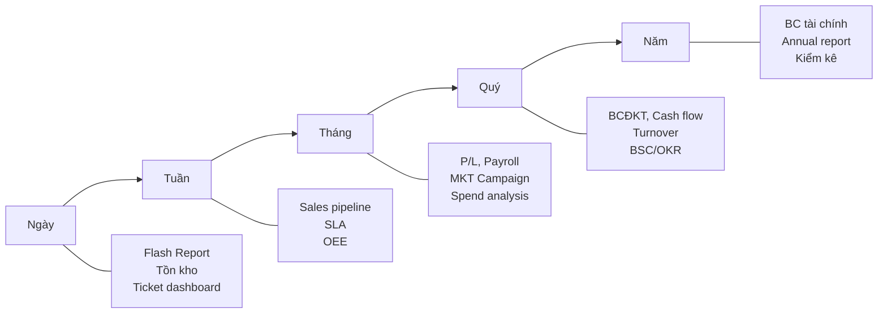
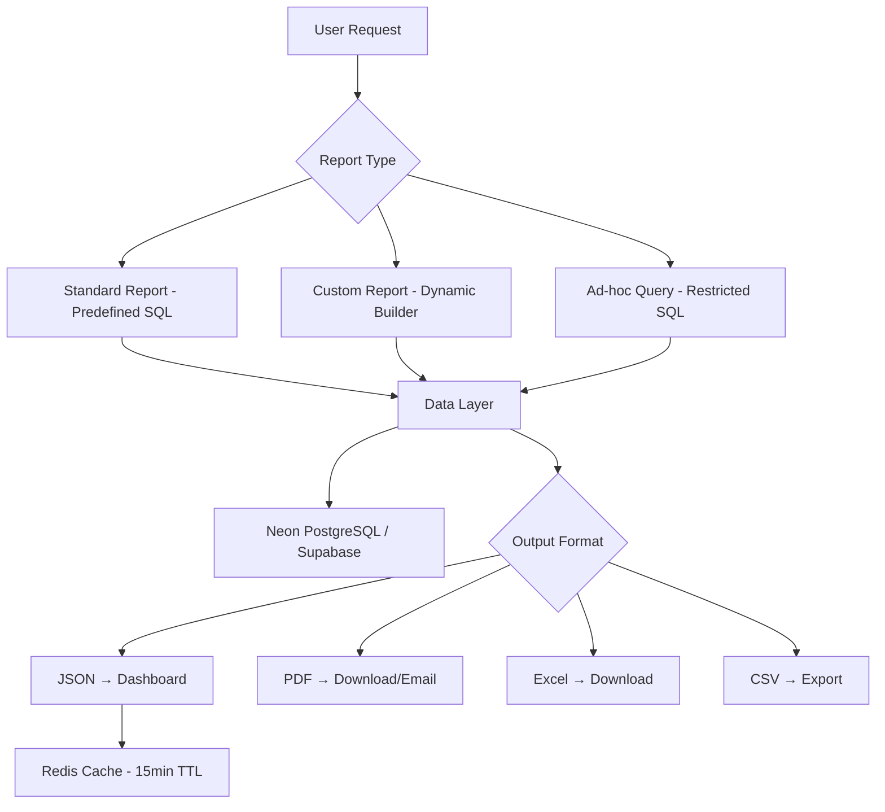

# Báo cáo Tổng hợp & Phân tích - Master Reporting Skill

## Tổng quan
Skill tổng hợp (master) quản lý toàn bộ hệ thống báo cáo doanh nghiệp VCT Platform, bao gồm danh mục báo cáo cross-module, framework xây dựng báo cáo, export patterns, và tiêu chuẩn hiển thị Việt Nam.

## Danh mục Báo cáo Toàn Doanh Nghiệp (Report Catalog)

### Phân loại theo Module

| # | Module | Skill Reference | Số lượng BC | Ưu tiên |
|---|--------|----------------|-----------|---------|
| 1 | Tài chính & Kế toán | `erp-finance-accounting` | 10+ | ⭐⭐⭐ |
| 2 | Nhân sự & Tuyển dụng | `erp-hr-recruitment` | 8+ | ⭐⭐⭐ |
| 3 | Sales & Kinh doanh | `erp-sales` | 7+ | ⭐⭐⭐ |
| 4 | Marketing | `erp-marketing` | 7+ | ⭐⭐ |
| 5 | Mua hàng & Kho vận | `erp-procurement-inventory` | 5+ | ⭐⭐ |
| 6 | Sản xuất & Chất lượng | `erp-production-quality` | 6+ | ⭐⭐ |
| 7 | CSKH & Hậu mãi | `erp-customer-service` | 5+ | ⭐⭐ |
| 8 | Hành chính & Pháp chế | `erp-admin-legal` | 6+ | ⭐ |
| 9 | Kế hoạch & Chiến lược | `erp-planning-strategy` | 5+ | ⭐⭐⭐ |
| 10 | CEO & Ban Giám đốc | `erp-ceo-executive` | Dashboard | ⭐⭐⭐ |

### Danh mục Chi tiết Toàn Bộ Báo cáo

#### A. Báo cáo Tài chính & Kế toán
| ID | Tên báo cáo | Tần suất | Đối tượng | Format |
|----|-----------|---------|---------|--------|
| FIN-01 | Báo cáo Kết quả HĐKD (P/L) | Tháng/Quý/Năm | CFO, CEO | PDF/Excel |
| FIN-02 | Bảng Cân đối Kế toán | Quý/Năm | CFO, CEO, HĐQT | PDF/Excel |
| FIN-03 | Lưu chuyển Tiền tệ | Quý/Năm | CFO, CEO | PDF/Excel |
| FIN-04 | Sổ Cái Tổng hợp | Tháng | KTT, Kế toán | Excel |
| FIN-05 | Sổ Nhật ký Chung | Tháng | KTT | Excel |
| FIN-06 | Tờ khai Thuế VAT | Tháng/Quý | KTT, Thuế | PDF |
| FIN-07 | Thuế TNDN tạm tính | Quý | KTT, CFO | PDF |
| FIN-08 | Bảng Tuổi nợ Phải thu | Tháng | CFO, Sales | Excel |
| FIN-09 | Bảng Tuổi nợ Phải trả | Tháng | CFO, Procurement | Excel |
| FIN-10 | Tỷ số Tài chính | Quý/Năm | CFO, CEO, HĐQT | PDF |
| FIN-11 | Budget vs Actual | Tháng/Quý | CFO, Trưởng phòng | Excel |
| FIN-12 | Dòng tiền Dự báo | Tuần | CFO | Excel |
| FIN-13 | Khấu hao TSCĐ | Tháng | KTT | Excel |

#### B. Báo cáo Nhân sự & Tuyển dụng
| ID | Tên báo cáo | Tần suất | Đối tượng | Format |
|----|-----------|---------|---------|--------|
| HR-01 | Headcount & Biến động | Tháng/Quý | CHRO, CEO | PDF/Excel |
| HR-02 | Tuyển dụng Pipeline | Tháng | CHRO, Recruitment | Excel |
| HR-03 | Bảng Lương Tháng | Tháng | C&B, CFO | Excel |
| HR-04 | Quỹ Lương Tổng hợp | Tháng/Quý | CHRO, CFO | Excel |
| HR-05 | Đào tạo & Phát triển | Quý/Năm | CHRO, L&D | PDF |
| HR-06 | Performance Review | Quý/6 tháng | CHRO, Trưởng phòng | PDF |
| HR-07 | Chấm công Tổng hợp | Tháng | HR Admin | Excel |
| HR-08 | Turnover Analysis | Quý/Năm | CHRO, CEO | PDF |
| HR-09 | BHXH/BHYT/BHTN | Tháng | C&B | Excel |

#### C. Báo cáo Sales & Kinh doanh
| ID | Tên báo cáo | Tần suất | Đối tượng | Format |
|----|-----------|---------|---------|--------|
| SAL-01 | Pipeline & Forecast | Tuần/Tháng | CSO, Sales Manager | Excel |
| SAL-02 | Doanh số theo NV/Team | Tuần/Tháng | CSO, Manager | Excel |
| SAL-03 | Win/Loss Analysis | Tháng/Quý | CSO | PDF |
| SAL-04 | Báo giá & Chuyển đổi | Tháng | Manager | Excel |
| SAL-05 | Công nợ KH | Tháng | CSO, CFO | Excel |
| SAL-06 | KPIs Sales Team | Tuần/Tháng | CSO | Dashboard |
| SAL-07 | Top Customers | Quý | CSO, CEO | PDF |

#### D. Báo cáo Marketing
| ID | Tên báo cáo | Tần suất | Đối tượng | Format |
|----|-----------|---------|---------|--------|
| MKT-01 | Campaign Performance | Tuần/Tháng | CMO, Manager | PDF |
| MKT-02 | Lead Generation | Tuần/Tháng | CMO, Sales | Excel |
| MKT-03 | Digital Analytics | Tuần | Digital Specialist | Dashboard |
| MKT-04 | Social Media Report | Tuần/Tháng | SM Manager | PDF |
| MKT-05 | Email Campaign | Tháng | Email Specialist | Excel |
| MKT-06 | ROI Marketing | Quý | CMO, CFO | PDF |
| MKT-07 | Ngân sách MKT | Tháng/Quý | CMO, CFO | Excel |

#### E. Báo cáo Mua hàng & Kho
| ID | Tên báo cáo | Tần suất | Đối tượng | Format |
|----|-----------|---------|---------|--------|
| PRO-01 | Spend Analysis | Tháng | Procurement Mgr | Excel |
| PRO-02 | Supplier Scorecard | Quý | Procurement Mgr | PDF |
| PRO-03 | ABC Analysis (Inventory) | Quý | Warehouse Mgr | Excel |
| PRO-04 | Xuất Nhập Tồn | Ngày/Tháng | Warehouse | Excel |
| PRO-05 | Cảnh báo Tồn kho | Ngày | Auto alert | Email |

#### F. Báo cáo Sản xuất & QC
| ID | Tên báo cáo | Tần suất | Đối tượng | Format |
|----|-----------|---------|---------|--------|
| SXR-01 | KH vs Thực tế SX | Tuần/Tháng | Production Mgr | Excel |
| SXR-02 | OEE Report | Ngày/Tuần | Production Mgr | Dashboard |
| SXR-03 | Defect / Quality | Ngày/Tháng | QC Manager | Excel |
| SXR-04 | Maintenance Report | Tháng | Maintenance Mgr | Excel |
| SXR-05 | Chi phí SX | Tháng | Production Mgr, CFO | Excel |
| SXR-06 | Năng suất Lao động | Ca/Ngày | Supervisor | Dashboard |

#### G. Báo cáo CSKH & Hậu mãi
| ID | Tên báo cáo | Tần suất | Đối tượng | Format |
|----|-----------|---------|---------|--------|
| SVC-01 | Ticket Dashboard | Ngày | CS Manager | Dashboard |
| SVC-02 | SLA Compliance | Tuần | CS Manager | PDF |
| SVC-03 | NPS/CSAT Survey | Tháng/Quý | CS VP, CEO | PDF |
| SVC-04 | Warranty Claims | Tháng | CS Manager | Excel |
| SVC-05 | Churn Analysis | Quý | CS VP, CMO | PDF |

#### H. Báo cáo Hành chính
| ID | Tên báo cáo | Tần suất | Đối tượng | Format |
|----|-----------|---------|---------|--------|
| ADM-01 | Chi phí Văn phòng | Tháng | Admin Mgr, CFO | Excel |
| ADM-02 | Hợp đồng sắp hết hạn | Tháng | Legal, Admin | Excel |
| ADM-03 | TSCĐ & Khấu hao | Tháng | KTT, Admin | Excel |
| ADM-04 | Compliance Checklist | Quý | Legal | PDF |

#### I. Báo cáo Điều hành (Executive)
| ID | Tên báo cáo | Tần suất | Đối tượng | Format |
|----|-----------|---------|---------|--------|
| EXE-01 | Executive Dashboard | Realtime | CEO, BGĐ | Dashboard |
| EXE-02 | Flash Report | Ngày | CEO, COO | Email/PDF |
| EXE-03 | Weekly Business Review | Tuần | BGĐ | PDF |
| EXE-04 | Monthly Business Review | Tháng | BGĐ, HĐQT | PDF |
| EXE-05 | BSC / OKR Progress | Quý | BGĐ, HĐQT | PDF |
| EXE-06 | Annual Report | Năm | HĐQT, Cổ đông | PDF |

---

## Framework Xây dựng Báo cáo

### 1. Lịch Báo cáo Định kỳ



### 2. Cross-module Dashboard Views

#### CEO View
| Mảng | Chỉ số chính | Nguồn module |
|------|-------------|-------------|
| Revenue | Doanh thu MTD/YTD, Growth rate | Sales |
| Profit | Lợi nhuận, Margin % | Finance |
| Cash | Tiền mặt hiện có, Cash flow forecast | Finance |
| Customers | KH mới, Churn rate, NPS | Sales + CSKH |
| People | Headcount, Turnover | HR |
| Production | OEE, Defect rate | Production |
| Pipeline | Pipeline value, Win rate | Sales |

#### CFO View
| Mảng | Chỉ số | Nguồn |
|------|--------|-------|
| P/L | DT, LN gộp, LN ròng, Margins | Finance |
| Balance Sheet | TS, Nợ, VCSH, Ratios | Finance |
| Cash Flow | CF from Ops/Inv/Fin, Forecast | Finance |
| Budget | Budget vs Actual, Variance | Finance + All |
| AR/AP | DSO, DPO, Aging | Finance + Sales |
| Payroll | Quỹ lương, % DT | HR + Finance |

#### COO View
| Mảng | Chỉ số | Nguồn |
|------|--------|-------|
| Operations | SLA, Ticket volume, Resolution time | CSKH |
| Production | OEE, Yield, Downtime | Production |
| Supply Chain | Inventory turns, Lead time | Procurement |
| Quality | Defect rate, Returns | Production + CSKH |
| People | Attendance, Productivity | HR |

### 3. Tiêu chuẩn Hiển thị Việt Nam

#### Định dạng Số & Tiền tệ
```
Số: 1.234.567 (dùng dấu chấm phân cách hàng nghìn)
Tiền: 1.234.567.890 VNĐ hoặc 1.234.567.890 đ
Ngoại tệ: $1,234.56 USD
Phần trăm: 12,5% (dùng dấu phẩy phân cách thập phân)
Ngày: dd/mm/yyyy (VD: 15/03/2026)
Giờ: HH:mm (VD: 09:30, format 24h)
```

#### SQL Formatting Helpers
```sql
-- Vietnamese number formatting
CREATE OR REPLACE FUNCTION format_vnd(amount NUMERIC)
RETURNS TEXT AS $$
BEGIN
    RETURN TO_CHAR(amount, 'FM999G999G999G990') || ' VNĐ';
END;
$$ LANGUAGE plpgsql IMMUTABLE;

-- Vietnamese date formatting
CREATE OR REPLACE FUNCTION format_date_vn(d DATE)
RETURNS TEXT AS $$
BEGIN
    RETURN TO_CHAR(d, 'DD/MM/YYYY');
END;
$$ LANGUAGE plpgsql IMMUTABLE;

-- Vietnamese percentage formatting
CREATE OR REPLACE FUNCTION format_pct_vn(val NUMERIC, decimals INT DEFAULT 1)
RETURNS TEXT AS $$
BEGIN
    RETURN REPLACE(TO_CHAR(val * 100, 'FM990.' || REPEAT('0', decimals)), '.', ',') || '%';
END;
$$ LANGUAGE plpgsql IMMUTABLE;
```

### 4. Export Patterns

#### Format Matrix
| Format | Use Case | Library (Go) | Library (Frontend) |
|--------|---------|-------------|-------------------|
| PDF | Báo cáo chính thức, ký duyệt | wkhtmltopdf, go-pdf | react-pdf |
| Excel | Phân tích, pivot, data | excelize | exceljs, xlsx |
| CSV | Import/export data | encoding/csv | Native JS |
| JSON API | Dashboard, real-time | net/http | fetch/axios |
| Email | Scheduled reports | gomail | Supabase Edge |

#### Export API Pattern
```go
// GET /api/v1/reports/{report_id}/export?format=pdf&from=2026-01-01&to=2026-03-31
type ExportRequest struct {
    ReportID  string `json:"report_id"`   // FIN-01, HR-03, SAL-01, etc.
    Format    string `json:"format"`      // pdf, xlsx, csv
    DateFrom  string `json:"date_from"`
    DateTo    string `json:"date_to"`
    OrgID     string `json:"org_id"`
    Filters   map[string]string `json:"filters"`
    Locale    string `json:"locale"`      // "vi-VN" default
}
```

### 5. Scheduling & Automation

```sql
-- Scheduled report jobs (pg_cron via Supabase)
-- Daily flash report
SELECT cron.schedule('daily-flash', '0 7 * * *',
    $$ SELECT generate_flash_report(CURRENT_DATE - 1) $$);

-- Weekly business review
SELECT cron.schedule('weekly-review', '0 8 * * 1',
    $$ SELECT generate_weekly_report(
        date_trunc('week', CURRENT_DATE - INTERVAL '7 days'),
        date_trunc('week', CURRENT_DATE) - INTERVAL '1 day'
    ) $$);

-- Monthly reports (P/L, Payroll, etc.)
SELECT cron.schedule('monthly-reports', '0 6 5 * *',
    $$ SELECT generate_monthly_reports(
        date_trunc('month', CURRENT_DATE - INTERVAL '1 month'),
        date_trunc('month', CURRENT_DATE) - INTERVAL '1 day'
    ) $$);
```

### 6. Report Builder Architecture



## Checklist Triển khai Báo cáo

- [ ] Xác định danh mục BC theo module (Report Catalog)
- [ ] Thiết kế schema DB cho dữ liệu phân tích (fact/dim tables)
- [ ] Viết SQL templates cho từng loại BC
- [ ] Implement API endpoints (Go backend)
- [ ] Export PDF/Excel với branding VCT
- [ ] Cache báo cáo trong Redis (TTL theo loại)
- [ ] Schedule báo cáo tự động (pg_cron)
- [ ] Vietnamese formatting (số, ngày, tiền)
- [ ] UTF-8 BOM cho CSV export (Support Excel VN)
- [ ] RBAC - phân quyền xem BC theo vai trò
- [ ] Dashboard frontend (Recharts/Chart.js)
- [ ] Mobile-responsive charts
- [ ] Audit log cho việc truy cập BC nhạy cảm
