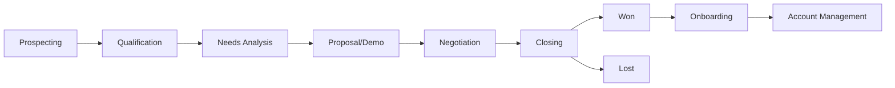
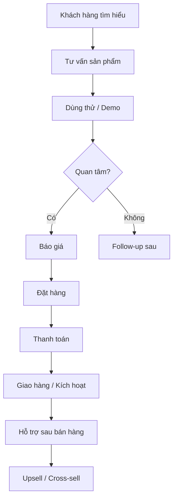
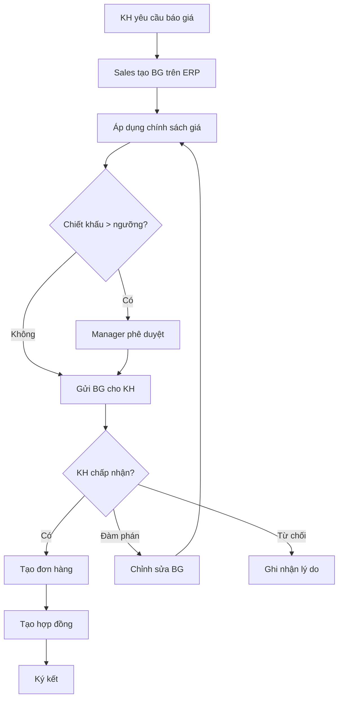
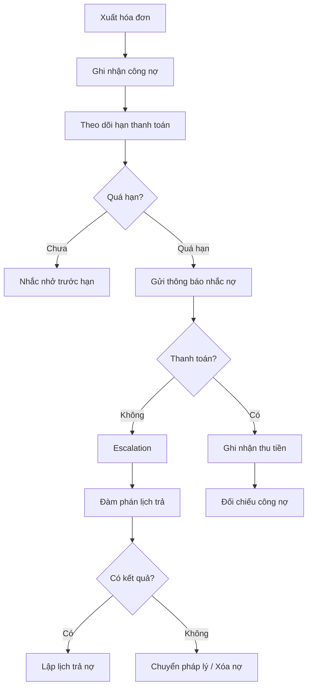

# Sales & Kinh doanh - ERP Module

## Tổng quan
Phòng Kinh doanh / Sales chịu trách nhiệm tạo doanh thu cho doanh nghiệp thông qua việc tìm kiếm khách hàng, đàm phán, ký kết hợp đồng, và chăm sóc khách hàng sau bán hàng.

## Vai trò & Nhân sự

| Vai trò | Trách nhiệm |
|---------|-------------|
| CSO / Giám đốc Kinh doanh | Chiến lược bán hàng, mục tiêu doanh thu |
| Sales Manager | Quản lý đội sales, phân vùng, coaching |
| Account Executive (AE) | Đàm phán, ký hợp đồng, upsell |
| Business Development (BDR) | Tìm kiếm khách hàng mới, cold outreach |
| Account Manager (AM) | Chăm sóc KH hiện tại, renew, upsell |
| Sales Admin | Hỗ trợ hành chính, báo giá, hợp đồng |
| Pre-sales / Solution Consultant | Tư vấn kỹ thuật, demo sản phẩm |

## Quy trình nghiệp vụ

### 1. Sales Pipeline (B2B)



#### Các giai đoạn Sales Pipeline
| Giai đoạn | Xác suất | Thời gian TB | Hành động chính |
|-----------|---------|-------------|----------------|
| Prospecting | 10% | 1-2 tuần | Tìm kiếm, cold call, email |
| Qualification | 20% | 1 tuần | BANT check, needs assessment |
| Needs Analysis | 40% | 1-2 tuần | Meeting, discovery call |
| Proposal/Demo | 60% | 1-2 tuần | Gửi báo giá, demo sản phẩm |
| Negotiation | 80% | 1-3 tuần | Thương lượng giá, điều khoản |
| Closing | 90% | 1 tuần | Ký hợp đồng, thanh toán |
| Won | 100% | - | Handover, onboarding |

#### BANT Qualification Framework
| Tiêu chí | Câu hỏi | Điểm (1-5) |
|----------|---------|-----------|
| **B**udget | Khách hàng có ngân sách? | Đã xác nhận NS? |
| **A**uthority | Ai ra quyết định? | Đã tiếp cận decision maker? |
| **N**eed | Nhu cầu thực sự là gì? | Pain point rõ ràng? |
| **T**imeline | Khi nào cần triển khai? | Timeline cụ thể? |

### 2. Quy trình Bán hàng B2C



### 3. Quản lý Khách hàng (CRM)

#### Phân loại Khách hàng
| Hạng | Doanh thu/năm | Tần suất chăm sóc | Account Manager |
|------|-------------|-------------------|----------------|
| VIP / Enterprise | > 1 tỷ VNĐ | Hàng tuần | Dedicated AM |
| Gold | 500tr - 1 tỷ | 2 lần/tháng | Senior AE |
| Silver | 100-500tr | Hàng tháng | AE |
| Standard | < 100tr | Hàng quý | Shared support |

#### Customer Journey
```
Awareness → Interest → Consideration → Purchase → Retention → Advocacy
    ↓          ↓           ↓              ↓          ↓           ↓
  MKT        MKT/        Sales          Sales      AM          AM/MKT
  Content    Sales       Demo/PG        Close      Support     Referral
```

### 4. Báo giá & Hợp đồng & Đơn hàng

#### Quy trình Báo giá


#### Template Báo giá
| STT | Mã SP/DV | Tên sản phẩm/dịch vụ | ĐVT | SL | Đơn giá | Chiết khấu | Thành tiền |
|-----|---------|---------------------|-----|----|---------|-----------|-----------| 
| 1 | SP001 | [Tên SP] | [ĐVT] | [SL] | [Giá] | [%] | [Tiền] |
| | | | | | **Tổng cộng** | | **[Tổng]** |
| | | | | | **VAT 10%** | | **[VAT]** |
| | | | | | **Tổng thanh toán** | | **[TT]** |

#### Trạng thái Đơn hàng
| Trạng thái | Mô tả | Bước tiếp |
|-----------|--------|----------|
| Draft | Nháp | Xác nhận |
| Confirmed | Đã xác nhận | Xuất kho / Thực hiện |
| Processing | Đang xử lý | Giao hàng |
| Delivered | Đã giao | Xuất hóa đơn |
| Invoiced | Đã xuất HĐ | Thu tiền |
| Paid | Đã thanh toán | Hoàn tất |
| Cancelled | Đã hủy | Lưu lý do |
| Returned | Đã trả hàng | Hoàn tiền/đổi |

### 5. Quản lý Công nợ Phải thu



#### Tuổi nợ phải thu
| Nhóm | Thời gian | Hành động | Rủi ro |
|------|----------|----------|--------|
| Trong hạn | 0-30 ngày | Theo dõi bình thường | Thấp |
| Quá hạn 1 | 31-60 ngày | Nhắc nhở email/điện thoại | Trung bình |
| Quá hạn 2 | 61-90 ngày | Gửi công văn, gặp trực tiếp | Cao |
| Quá hạn 3 | 91-180 ngày | Escalation lên quản lý | Rất cao |
| Nợ khó đòi | > 180 ngày | Pháp lý / Trích lập dự phòng | Cực cao |

### 6. Chính sách Chiết khấu & Khuyến mãi

| Loại CK | Điều kiện | Mức CK | Phê duyệt |
|---------|----------|--------|----------|
| CK thương mại | Đại lý, mua sỉ | 5-15% | Manager |
| CK thanh toán | Thanh toán sớm | 2-5% | Tự động |
| CK doanh số | Đạt target quý | 3-10% | CSO |
| Khuyến mãi | Chương trình MKT | Theo CT | CMO + CSO |
| CK đặc biệt | VIP, chiến lược | Thỏa thuận | CEO |

### 7. KPIs & Báo cáo Sales

| KPI | Công thức | Target |
|-----|----------|--------|
| Doanh thu | Tổng giá trị đơn hàng | Theo plan |
| Số deal won | Deals closed | ≥ target/tháng |
| Win rate | Won / Total opportunities | > 30% |
| Avg deal size | Total revenue / Deals | Tăng MoM |
| Sales cycle | Avg time prospect → close | < 45 ngày |
| Pipeline value | Tổng giá trị pipeline | 3x target |
| Activity metrics | Calls, emails, meetings/ngày | ≥ KPI |
| Churn rate | KH mất / Tổng KH | < 5%/quý |
| Upsell rate | Revenue upsell / Total revenue | > 15% |
| DSO (Days Sales Outstanding) | Avg thời gian thu tiền | < 45 ngày |

## Quyền hạn trong ERP

| Chức năng | CSO | Sales Manager | AE/BDR | AM | Sales Admin |
|-----------|-----|-------------|--------|-----|------------|
| Pipeline toàn công ty | ✅ | Team mình | Cá nhân | Cá nhân | Xem |
| Tạo báo giá | ✅ | ✅ | ✅ | ✅ | ✅ |
| Phê duyệt CK > 10% | ✅ | ✅ | Không | Không | Không |
| Phê duyệt CK > 20% | ✅ | Không | Không | Không | Không |
| Ký hợp đồng | ✅ | ≤ 500tr | Không | Không | Không |
| Xem công nợ | ✅ | Team | Cá nhân | KH phụ trách | ✅ |
| Báo cáo doanh số | ✅ | Team | Cá nhân | KH phụ trách | Tổng hợp |
