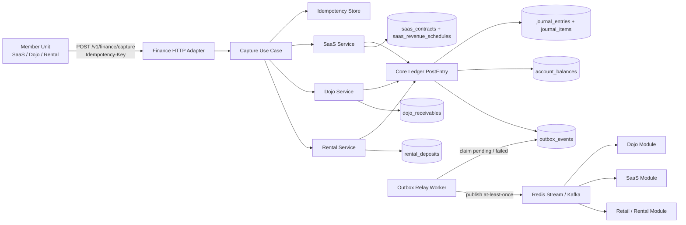

# Finance Flow Architecture

## Notes

- `Capture Use Case` enforces idempotency before dispatching into a business-specific adapter.
- `Core Ledger PostEntry` remains the single posting gate for all business lines.
- `outbox_events` is the boundary between committed accounting data and cross-module propagation.
- The relay worker uses claim-and-retry semantics to keep delivery at-least-once.
