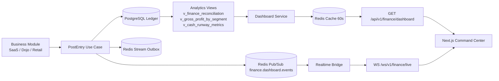

# Finance Realtime Dashboard

## Live Snapshot API

Use the executive snapshot endpoint for the initial page load:

`GET /api/v1/finance/dashboard`

Required headers:

- `X-App-Role: cfo|ceo|system_admin`
- `X-Actor-ID: <actor-id>`

Example response shape:

```json
{
  "company_code": "VCT_GROUP",
  "generated_at": "2026-03-22T09:00:00Z",
  "data_mode": "live",
  "recommended_refresh": "websocket",
  "cards": [],
  "revenue_mix": [],
  "cashflow_chart": { "granularity": "month", "x_axis": [], "series": [] },
  "runway_projection": []
}
```

## WebSocket Endpoint

For browser clients, native WebSocket does not allow custom headers, so alpha clients can connect with query params:

`GET /ws/v1/finance/live?role=ceo&actor_id=ceo-001`

Example frontend code:

```ts
const snapshot = await fetch("http://localhost:8080/api/v1/finance/dashboard", {
  headers: {
    "X-App-Role": "ceo",
    "X-Actor-ID": "ceo-001",
  },
}).then((res) => res.json());

const socket = new WebSocket(
  "ws://localhost:8080/ws/v1/finance/live?role=ceo&actor_id=ceo-001",
);

socket.addEventListener("message", (event) => {
  const payload = JSON.parse(event.data);
  if (payload.event === "NEW_TRANSACTION") {
    // Fast path: update cards optimistically or re-fetch snapshot.
    void refreshDashboard();
  }
});
```

Realtime payload:

```json
{
  "event": "NEW_TRANSACTION",
  "company_code": "VCT_GROUP",
  "entry_id": "f8c7...",
  "reference_no": "PT-0001/03-26",
  "amount": 5000000,
  "segment": "DOJO",
  "source_module": "DOJO",
  "timestamp": "2026-03-22T09:00:00Z"
}
```

## Runtime Behavior

- Dashboard snapshots are cached in Redis for `60s`.
- Any new posted ledger entry publishes a finance event into Redis Pub/Sub.
- Every API pod subscribes to the same channel, invalidates its dashboard cache, and broadcasts to connected WebSocket clients.
- Because fan-out is Redis-backed, sticky sessions are not required at the ingress layer.

## Architecture


